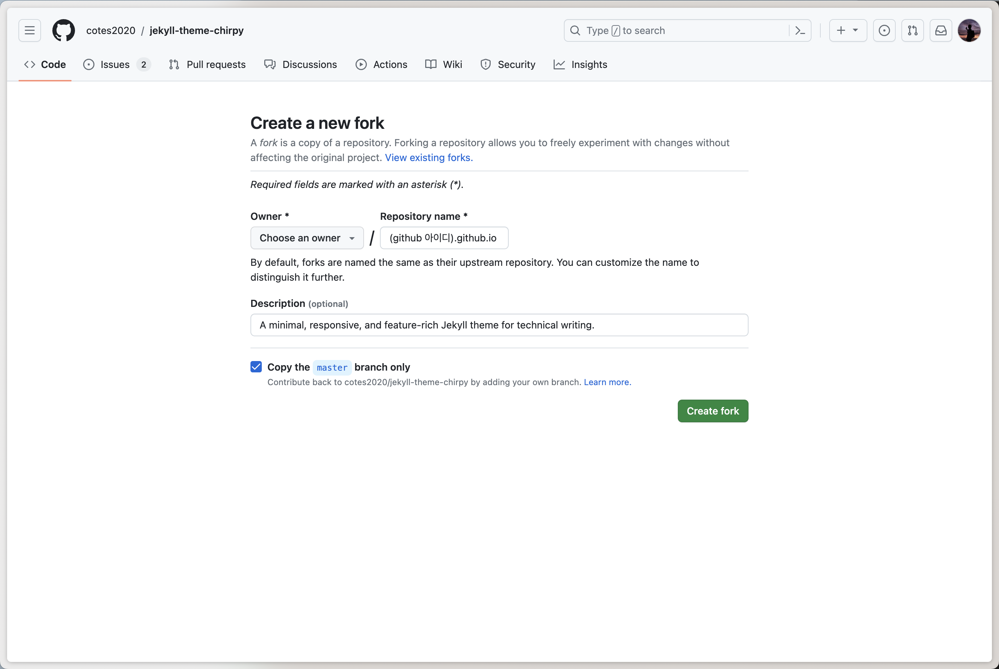
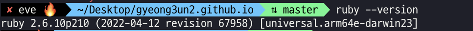
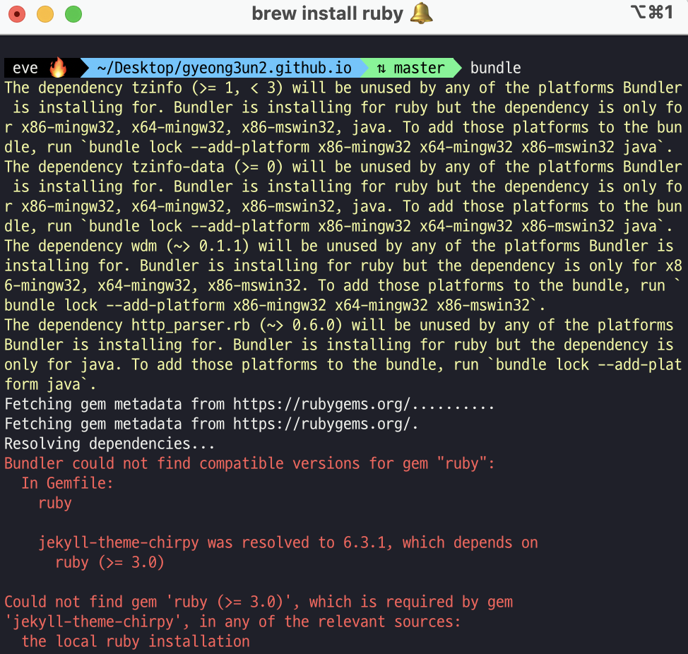

## **1. Chirpy 테마 fork받기**
아래 링크를 누르면 fork를 받기 위한 새로운 레포지토리 생성 페이지가 뜰 것이다.  
그러면 `<github 아이디>.github.io`라는 이름으로 fork를 하면 된다.  

<https://github.com/cotes2020/jekyll-theme-chirpy/fork>



<br>

그런데 여기서 <span style="background-color: #dcffe4">만약 github 아이디로 안한다면 어떻게 될까?</span> 라는 의문을 품었다.  
  
<br>

그래서 github 아이디는 `devGEP`이고, 블로그 이름은 `gyeong3un2`로 해봤더니 아래와 같은 결과가 나오게 되었다.  
> 블로그 주소가 `https://devgep.github.io/gyeong3un2.github.io/`라는 주소가 나오게 되었다.  

<br>

만약 이미 레포지토리를 만들었다고 해도 Setting에서 이름을 바꾸면 되니까 문제는 없으니 걱정하지 말자!

<br>

## **2. 초기화하기**
fork를 받았다면 clone을 하고, 터미널을 연다.
먼저 chirpy를 초기화해야 한다.
```shell
$ tools/init.sh
[INFO] Initialization successful!  <-- 이런 메세지가 나오면 성공입니다.
```
<br>

## **3. 로컬 환경 세팅하기**
이제 로컬 환경에서 실행해볼 수 있는데, 그 전에 로컬 환경 세팅을 해야 한다.  
저는 안했다가 자꾸 안되니까... 이게 왜 안되는 걸까? 라는 생각하면서 시간을 허비했습니다..ㅠㅠ

<br>

### 먼저 Ruby를 설치해야 합니다.
우선 제가 macOS를 쓰고 있어서 모든 내용이 macOS 기준임을 먼저 알려드립니다!
```shell
$ brew install ruby
```

ruby 설치 시간이 꽤 걸려서 기다리시면 됩니다!  
설치가 완료되었다면, 아래 명령어로 ruby 버전을 확인해보시면 3.0을 안 넘을 거에요!
```shell
$ ruby --v
ruby 2.6.10p210 (2022-04-12 revision 67958) [universal.arm64e-darwin23] <- 저는 이렇게 나왔어요!
```


<br>

이렇게 설치하고 로컬 환경에서 실행하려고 하면 다음과 같은 에러가 났다.



내 나름대로 해석해보자면, jekyll-theme-chirpy는 6.3.1 버전으로 출시가 되었는데, 이것은 ruby 3.0 버전 이상부터 지원을 하는 것으로 이해했습니다.  
<br>

그래서 ruby 버전을 3.0 버전 이상을 설치해줘야 한다.  
하지만, brew install로는 2.6 버전까지만 설치가 되는 것 같아서 다른 방법이 필요했다.  
<br>

그래서 찾아낸 방법이 rbenv을 설치해서 하는 것이다.  
그렇다면, rbenv를 설치해보자. 아래 명령어를 통해서 설치할 수 있다.
```shell
$ brew install rbenv
```
<br>

설치하고 나서, 아래 명령어를 입력해보면 설치할 수 있는 ruby 버전이 나온다.
```shell
$ rbenv install -l
3.0.6
3.1.4
3.2.2
jruby-9.4.5.0
mruby-3.2.0
picoruby-3.0.0
truffleruby-23.1.1
truffleruby+graalvm-23.1.1
```

이중에서 나는 3.0만 넘으면 되니까 3.0.6으로 하려고 한다.   
아래 명령어를 통해서 버전을 설치해보자.
```shell
$ rbenv install 3.0.6
```
<br>

그리고 rbenv 버전을 확인해보면, 이렇게 뜰 것이다.
```shell
$ rbenv versions
* system
  3.0.6
```
<br>

**설치한 3.0.6으로 글로벌, 로컬 설정**
- 대부분 globl은 자동으로 설정되지만, local까지 설정 필요
- local은 해당 명령어를 입력한 로컬 스토리지에 적용되는 것이고, global은 해당 로컬 뿐 아닌 전역적으로 적용되는 것이며 local의 우선순위가 높음
```shell
$ rbenv global 3.0.6
$ rbenv local 3.0.6
```

그리고 rbenv 버전을 확인해보면, 이렇게 뜰 것이다.
```shell
$ rbenv versions
  system
* 3.0.6 (set by /Users/gyeoeul/Desktop/gyeong3un2.github.io/.ruby-version)
```
<br>

이제 됐겠지! 하고 실행해보면, 그래도 안된다...  
그래서 ruby 버전을 확인해보니 아직까지도 2.6.x 버전으로 나오는 것을 볼 수 있었다.

이것은 적용이 안된 것이니 ~/.zshrc 파일에다가 적용을 해주자.  
```shell
$ nano ~/.zshrc
```
<br>

열어서 아래 두줄을 추가해주자. 
```shell
eval "$(rbenv init -)" 
export PATH="[3.0 버전 이상의 ruby가 설치된 경로]/.gem/ruby/x.x.x/bin:$PATH"
x.x.x: ruby 버전
```
<br>
만약 ruby가 어디 설치되었는지 잊었다면 `where ruby`를 통해서 3.0 버전 이상의 ruby가 설치된 경로를 찾자. 이때, 2.x.x 버전의 ruby도 같이 찾아지니 주의해야 한다.‼️  
<br>

나 또한, 잊어버려서 다음과 같은 방법으로 ruby의 버전을 확인하였다.
```shell
$ where ruby
/Users/.../ruby
/usr/bin/ruby

$ /Users/.../ruby --version
$ /usr/bin/ruby --version
```

이제 적용을 시켜주고, 터미널을 종료하고 재실행하거나 새 터미널을 열고 버전을 확인하면 3.0.x으로 보이는 것을 볼 수 있다.
```shell
$ source ~/.zshrc
```
<br>

## **4. 로컬 환경에서 실행해보기**
이제 로컬에서 실행해보자.
우선 jekyll을 로컬에서 실행시키기 위해 터미널에서 아래 명령을 사용하여 의존성이 있는 모듈을 모두 설치한다.  
이미 chirpy에 기본설정이 되어 있기 때문에 아래 명령만으로 필요한 모든 것이 설치된다.
```shell
$ bundle
```
<br>

많은 내용들이 설치되고, 터미널에서 다음 명령을 사용하여 jekyll을 실행시키려고 하는데 난 이런 에러가 떴었다. <span style="background-color: #ffdce0">이건 $PATH 변수 설정 누락이 되었기 때문에 발생하는 에러이다.</span>  
하지만, 이 블로그를 정리할 때, 방금 전 ~/.zshrc 파일에다가 $PATH를 해놓았기 때문에 이 블로그를 보고 따라하고 있다면, 발생하지 않을 것이다.
```shell
$ jekyll serve
zsh: command not found: jekyll
```
<br>

성공적으로 수행됐다면, 주소가 뜰 것이고, 이걸 들어가보면 기본 블로그 화면이 나타난다.  
`Server address: http://127.0.0.1:4000/`

<br>

# **참고자료**
> **전체적인 테마 적용할 때, 참고**:  
> <https://www.irgroup.org/posts/jekyll-chirpy/>
>
> **ruby 3.0 버전 설치할 때, 참고**:  
> <https://2vup.com/mac-ruby-update/>  
> <https://ios-development.tistory.com/1202>
>
> **jekyll not found 오류 해결할 때, 참고**:  
> <https://withhsunny.tistory.com/88>