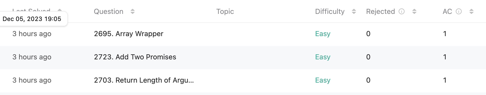

[LeetCode](https://leetcode.com/)라는 사이트가 코딩 테스트 준비하는데 좋은 사이트라고 들었다. 알고리즘 문제 해결과 코딩 인터뷰 준비를 위한 강력한 도구로 인정받고 있다고 한다. 아래는 참고 사이트를 통해 장점을 가져와 봤다.  


1. **다양한 알고리즘 문제와 코드 실행 기능**  
다양한 알고리즘 문제를 제공하며, 온라인 코드 편집기를 통해 코드를 작성하고 실행해 볼 수 있어 효율적인 학습이 가능하다.  

2. **실제 기업 인터뷰에 유용한 문제**  
기업 코딩 인터뷰에서 출제되는 유형과 유사한 문제를 제공하므로 실전 경험을 쌓을 수 있다.  

3. **커뮤니티 기능**  
사용자들은 솔루션을 공유하고 토론할 수 있으며, 다른 개발자들의 접근 방식과 최적화 아이디어를 배우고 문제 해결 능력을 향상시킬 수 있다.  

<br>

---

<br>

그래서 LeetCode를 처음으로 사용해봤다. 그랬더니 내가 이제껏 기업 코테를 준비할 때나, 시험을 볼 때 보지 못한 유형들을 만나서 처음에는 기본적인 것을 먼저 풀어보려고 한다.  

<br>

## **오늘의 코딩테스트 - 3 문제 완료**
{: height="300"} 

---

## **첫번째 문제 - [2703. Return Length of Arguments Passed](https://leetcode.com/problems/return-length-of-arguments-passed/)**

#### **접근 방식**
이 문제는 간단히 요소의 숫자만 구하면 되기 때문에 length로 길이를 출력시키는 방법으로 문제를 풀었다.

#### **작성한 코드**
```javascript
/**
 * @param {...(null|boolean|number|string|Array|Object)} args
 * @return {number}
 */
var argumentsLength = function(...args) {
	return args.length;
};

/**
 * argumentsLength(1, 2, 3); // 3
 */
```

<br>

## **두번째 문제 - [2723. Add Two Promises](https://leetcode.com/problems/add-two-promises/)**

#### **접근 방식**
이 문제는 **Promise라는 것을 다루는 문제**였다.  

promise1과 promise2를 파라미터로 주어지고, 이걸 합한 값을 출력하면 되는 문제였지만, setTimeout이라는 promise가 들어가서 당황했다.  

처음 접한 유형이라 당황하기도 했고, 감이 안 잡혀서 <u>Solution을 보고 이해하고 풀었다.</u>  

<br>

일단 async 함수로 선언되었기 때문에 비동기적으로 실행된다. 
1. **Promise.all 사용**: `Promise.all` 메서드는 여러 프로미스들을 병렬로 실행하고, 모든 Promise들이 완료될 때까지 기다린 후 결과값들을 배열로 반환한다. 
2. **await 사용**: `await` 키워드는 Promise의 해결을 기다린다. 이것은 코드를 작성할 때 Promise가 이미 해결된 것처럼 처리할 수 있게 해준다. 즉, 프로미스가 해결될 때까지 함수의 실행을 일시 중지하고, 해결된 후에 결과값을 반환한다. 이렇게하면 비동기 작업을 마치 동기적인 코드처럼 쉽게 다룰 수 있다.  

<br>

각각 promise1과 promise 모두 완료되면 각각 결과값들을 각각 변수 `p1`, `p2`에 할당한다. 그리고 나서 더한 결과를 반환한다.

#### **작성한 코드**
```javascript
/**
 * @param {Promise} promise1
 * @param {Promise} promise2
 * @return {Promise}
 */
var addTwoPromises = async function(promise1, promise2) {
    const [p1, p2] = await Promise.all([promise1, promise2]);

    return p1 + p2;
};

/**
 * addTwoPromises(Promise.resolve(2), Promise.resolve(2))
 *   .then(console.log); // 4
 */
```

<br>

## **세번째 문제 - [2695. Array Wrapper](https://leetcode.com/problems/array-wrapper/)**

#### **접근 방식**
이 문제는 결과를 쓰는 코드를 처음 본 문제의 유형이였다.  
그래서 이 문제도 감이 안 잡혀서 <u>Solution을 보고 이해하고 풀었다.</u>
1. **ArrayWrapper**: 일단 ArrayWrapper 함수에서 정수 배열 `nums`를 매개변수로 받아 클래스의 인스턴스 속성 `this.nums`에 할당한다.  
2. **valueOf 메서드**: 이 메서드는 `+` 연산자가 두 `ArrayWrapper` 인스턴스에 사용될 때 호출된다. `valueOf` 메서드는 `this.nums` 배열의 모든 요소를 더하여 그 합을 반환한다. 이는 `Array.prototype.reduce` 메서드를 사용하여 구현되며, **배열의 모든 요소를 순회하면서 각 요소를 합산한다.**
3. **toString 메서드**: 이 메서드는 `String()` 함수가 `ArrayWrapper` 인스턴스에 대해 호출될 때 실행된다. `toString` 메서드는 `this.nums` 배열의 요소를 쉼표로 구분된 문자열로 변환하고, 대괄호로 둘러싼 형태의 문자열을 반환한다. 이는 `Array.prototype.join` 메서드를 사용하여 구현되며, **배열의 요소들을 쉼표로 연결한 문자열을 만든다.**

#### **작성한 코드**
```javascript
/**
 * @param {number[]} nums
 * @return {void}
 */
var ArrayWrapper = function(nums) {
    this.nums = nums
};

/**
 * @return {number}
 */
ArrayWrapper.prototype.valueOf = function() {
    return this.nums.reduce((subSum, subNum) => subSum + subNum, 0)
}

/**
 * @return {string}
 */
ArrayWrapper.prototype.toString = function() {
    return '[' + this.nums.flat().join(',') + ']'
};

/**
 * const obj1 = new ArrayWrapper([1,2]);
 * const obj2 = new ArrayWrapper([3,4]);
 * obj1 + obj2; // 10
 * String(obj1); // "[1,2]"
 * String(obj2); // "[3,4]"
 */
```

<br>

## **네번째 문제 - [[프로그래머스] 과일 장수 문제](https://school.programmers.co.kr/learn/courses/30/lessons/135808)**

#### **접근 방식**
이 문제는 사과 상자를 포장하여 판매할 때, 얻을 수 있는 최대 이익을 계산하는 문제이다. 주어진 조건은 다음과 같다.

1. **사과의 점수 분류**: <u>사과는 1점에서 k점까지 점수로 분류</u>되며, 1점이 최하위이고 k점이 최상위
2. **상자 당 사과 개수**: <u>한 상자에는 m개의 사과</u>를 담는다.
3. **상자 가격 결정 방법**: 상자의 가격은 <u>상자에 담긴 사과 중 가장 낮은 점수(p)와 상자 당 사과 개수(m)를 곱한 값</u>이다. 즉, **p * m**이다.
4. **이익 최대화**: 가능한 많은 사과를 팔아 최대 이익을 얻어야 한다. 남는 사과는 판매하지 않고 버린다.

이때, 그냥 순서를 나열해봤다.
1. 정렬되지 않은 숫자 배열을 내림차순으로 바꾼다.
2. 거기서 m만큼씩 자른다.
3. m 만큼 자른 곳에서 가장 낮은 숫자이므로, 딱 자른 곳 맨 마지막에 남는 숫자가 가장 낮은 숫자이다.
4. 가장 낮은 숫자 * m을 상자 가격으로 한다.
5. 모든 상자 가격을 더하고 반환한다.

<br>

이걸 예시로 들자면,
**score = [4, 1, 2, 2, 4, 4, 4, 4, 1, 2, 4, 2] 이고, k = 4, m = 3**라고 하자.  

(1) 그럼 먼저 내림차순으로 바꾼다.  
scoreSorted = [4, 4, 4, 4, 4, 4, 2, 2, 2, 2, 1, 1], m = 3  

(2) m(=3)씩 자른다.  
4, 4, 4 / 4, 4, 4 / 2, 2, 2 / 2, 1, 1  

(3) 상자에서 가장 낮은 숫자 찾기  
4, 4, **<u>4</u>** / 4, 4, **<u>4</u>** / 2, 2, **<u>2</u>** / 2, 1, **<u>1</u>**  

(4) 상자 가격 구하기  
`4 * 3`, `4 * 3`, `2 * 3`, `1 * 3`

(5) 총 상자 가격  
`4 * 3` + `4 * 3` + `2 * 3` + `1 * 3` = 33  

<br>

이렇게 흐름이 되는데, 결과적으로는 가장 낮은 숫자가 **2, 5, 8, 11** 인덱스에 있게 된다. 이는 즉  
2 = (3 - 1) = (m - 1)  
5 = (3 - 1) + 3 * 1 = (m - 1) + (m * 1)  
8 = (3 - 1) + 3 * 2 = (m - 1) + (m * 2)  
11 = (3 - 1) + 3 * 3 = (m - 1) + (m * 3)  

이걸 한줄의 코드로 적는다면? **(m-1) + 3*i (0<=i<=3)**

#### **작성한 코드**
```javascript
function solution(k, m, score) {
    let answer = 0;

    score.sort().reverse(); // 내림차순

    for (let i = m-1; i < score.length; i += m) {
        answer += score[i] * m;
    }

    return answer;
}
```


# **참고자료**
> **LeetCode 참고**:  
> <https://m.blog.naver.com/megaitacademy/223214519269> 