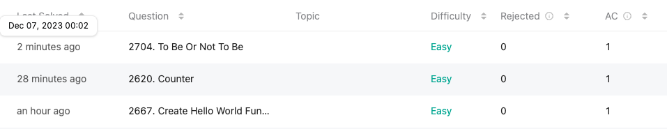

## **오늘의 코딩테스트 - 3 문제 완료**
{: height="300"} 

---

## **첫번째 문제 - [2667. Create Hello World Function](https://leetcode.com/problems/create-hello-world-function/?envType=study-plan-v2&envId=30-days-of-javascript)**

#### **접근 방식**
처음에 문제 이해를 잘 못했다. 하지만, 다시 차근차근 읽어보니 createHelloWorld라는 함수가 있고, 이 함수는 항상 "Hello World"를 반환한다.  

#### **작성한 코드**
```javascript
/**
 * @return {Function}
 */
function createHelloWorld() {
    return function(...args) {
        return "Hello World";
    }
};

/**
 * const f = createHelloWorld();
 * f(); // "Hello World"
 */
```

<br>

## **두번째 문제 - [2620. Counter](https://leetcode.com/problems/counter/description/?envType=study-plan-v2&envId=30-days-of-javascript)**

#### **접근 방식**
이 문제는 **카운터 함수를 생성하는 프로그래밍 문제**이다.  
주어진 n에 대해 이 카운터 함수는 처음 호출될 때 `n`을 반환하고, 이후에 호출될 때마다 이전 값보다 1 더 큰 값을 반환해야 한다.  

예를 들어, 입력으로 `n = 10`이 주어지고, 카운터 함수가 세 번 호출된다면, 출력은 다음과 같다.  
- **첫 번째 호출**에서, 카운터는 초기값인 10을 반환한다.
- **두 번째 호출**에서, 카운터는 이전 값(10)보다 1 더 큰 11을 반환한다.
- **세 번째 호출**에서, 카운터는 이전 값(11)보다 1 더 큰 12를 반환한다.

#### **작성한 코드**
```javascript
/**
 * @param {number} n
 * @return {Function} counter
 */
function createCounter(n) {
    let count = n;

    return function() {
        return count++;
    }
}
/** 
 * const counter = createCounter(10)
 * counter() // 10
 * counter() // 11
 * counter() // 12
 */
```

위 방식은 **count를 먼저 반환하고 값이 증가하기 때문에 제대로 동작**한다.  

하지만 이렇게 풀었을 때, 후위 연산자는 실제 애플리케이션을 개발할 때 사용하면 간결함을 제공하지만, 때때로 명확성 측면에서 문제가 될 수 있다고 한다. 그래서 다른 방법을 찾다가 아래와 같은 방식을 발견하게 되었다.  

먼저 **count 값을 다른 변수에 저장하고 count를 1 증가시킨 뒤, 증가시키기 전 count 값을 저장했던 다른 변수를 반환하는 것**이다.  

```javascript
function createCounter(n) {
    let count = n;

    return function() {
        const currentCount = count;
        count += 1;
        return currentCount;
    }
}
```

<br>

## **세번째 문제 - [2704. To Be Or Not To Be](https://leetcode.com/problems/to-be-or-not-to-be/description/?envType=study-plan-v2&envId=30-days-of-javascript)**

#### **접근 방식**
이 문제는 개발자들이 자신들의 코드를 테스트할 수 있도록 돕는 `expect` 함수를 작성하는 것에 관한 프로그래밍 문제이다. `expect` 함수는 어떤 값 `val`을 입력받아, 두 가지 함수(`toBe`와 `notToBe`)를 포함하는 객체를 반환해야 한다.  
1. toBe(val): 이 함수는 다른 값을 인자로 받는다. 두 값이 정확히 동일한 경우 `true`를 반환하고, 동일하지 않으면 `"Not Equal"`이라는 에러를 발생시켜야 한다.  
2. notToBe(val): 이 함수도 다른 값을 인자로 받는다. 두 값이 정확히 동일하지 않을 경우 `true`를 반환하고, 동일하면 `"Equal"`이라는 에러를 발생시켜야 한다.  

#### **작성한 코드**
```javascript
/**
 * @param {string} val
 * @return {Object}
 */
function expect(val) {
    return {
        toBe: (val2) => {
            if (val !== val2) throw new Error("Not Equal");
            else return true;
        },
        notToBe: (val2) => {
            if (val === val2) throw new Error("Equal");
            else return true;
        }
    }
};

/**
 * expect(5).toBe(5); // true
 * expect(5).notToBe(5); // throws "Equal"
 */
```