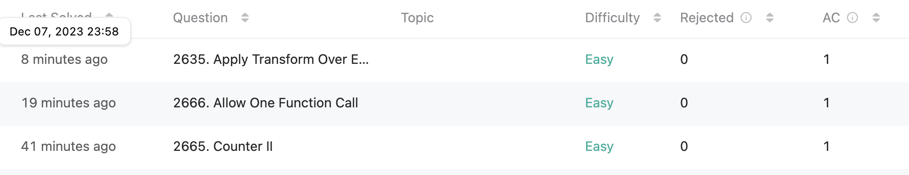

## **오늘의 코딩테스트 - 3 문제 완료**
{: height="300"} 

---

## **첫번째 문제 - [2665. Counter II](https://leetcode.com/problems/counter-ii/?envType=study-plan-v2&envId=30-days-of-javascript)**

#### **접근 방식**
이 문제는 초기 정수 `init`을 인자로 받고 세 가지 함수를 포함하는 객체를 반환하는 `createCounter` 함수를 작성하는 것을 요구한다. 각 함수는 다음과 같은 기능을 가진다.  

1. `increment()` 함수: 카운터의 현재 값을 1 증가시킨 후, 그 값을 반환한다.
2. `decrement()` 함수: 카운터의 현재 값을 1 감소시킨 후, 그 값을 반환한다.
3. `reset()` 함수: 카운터의 현재 값을 `createCounter`를 호출할 때 제공된 초기 값 `init`으로 설정한 후 그 값을 반환한다.  

#### **작성한 코드**
```javascript
/**
 * @param {integer} init
 * @return { increment: Function, decrement: Function, reset: Function }
 */
function createCounter(init) {
    let num = init;
    
    return {
        increment: () => {
            num += 1;
            return num;
        },
        decrement: () => {
            num -= 1;
            return num;
        },
        reset: () => {
            num = init;
            return num;
        }
    }
};

/**
 * const counter = createCounter(5)
 * counter.increment(); // 6
 * counter.reset(); // 5
 * counter.decrement(); // 4
 */
```

<br>

전위 연산자를 사용하면 다음과 같이 코드를 짤 수 있다. 이렇게 되면 런타임과 메모리가 줄어든다.

```javascript
function createCounter(init) {
    let num = init;
    
    return {
        increment: () => {
            return ++num;
        },
        decrement: () => {
            return --num;
        },
        reset: () => {
            num = init;
            return num;
        }
    }
};
```

<br>

## **두번째 문제 - [2666. Allow One Function Call](https://leetcode.com/problems/allow-one-function-call/)**

#### **접근 방식**
이 문제는 주어진 함수 `fn`을 받아서, 이 함수가 오직 한 번만 호출될 수 있도록 하는 새로운 함수를 반환하는 것을 요구한다. 반환된 새로운 함수는 처음 호출될 때 원래 함수 `fn`과 동일한 결과를 반환해야 한다. 그러나 그 이후에는 함수가 호출되더라도 `undefined`를 반환해야 한다.  

그래서 `isOneTime`이라는 변수를 만들어서 처음에는 당연히 true여서 `fn`과 동일한 결과를 출력한다. 그리고 한번 출력하면 이제는 `undefined`를 출력해야 하기 때문에 `isOneTime`을 false로 변환한다.  

#### **작성한 코드**
```javascript
/**
 * @param {Function} fn
 * @return {Function}
 */
function once(fn) {
    let isOneTime = true;
    
	return function(...args){
        if (isOneTime) {
            let result = fn(...args);
            isOneTime = false;
            return result;
        } else return undefined;
    }
};

/**
 * let fn = (a,b,c) => (a + b + c)
 * let onceFn = once(fn)
 *
 * onceFn(1,2,3); // 6
 * onceFn(2,3,6); // returns undefined without calling fn
 */

```

<br>

## **세번째 문제 - [2635. Apply Transform Over Each Element in Array](https://leetcode.com/problems/apply-transform-over-each-element-in-array/?envType=study-plan-v2&envId=30-days-of-javascript)**

#### **접근 방식**
이 문제는 정수 배열 `arr`와 매핑 함수 `fn`이 주어졌을 때, 각 배열 요소에 변환을 적용하여 새로운 배열을 반환하는 것을 요구한다. 반환되는 배열은 `returnedArray[i] = fn(arr[i], i)`와 같이 생성되어야 한다. 문제의 핵심은 내장된 `Array.map` 메소드를 사용하지 않고 이 작업을 수행하는 것이다.  

`result`라는 배열을 만들어서 결과를 이곳에 넣을 것이다. for문에서 index를 돌면서 `fn`에서 결과값을 순차적으로 넣으면 마지막에 `result`를 반환하면 답이 나온다.  

#### **작성한 코드**
```javascript
/**
 * @param {number[]} arr
 * @param {Function} fn
 * @return {number[]}
 */
function map(arr, fn) {
    const result = [];
    
    for(let i = 0; i < arr.length; i += 1) {
        result.push(fn(arr[i], i));
    }
    
    return result;
};
```