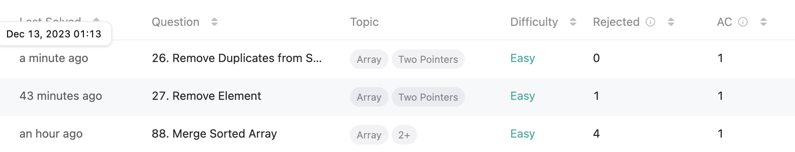

## **오늘의 코딩테스트 - 3 문제 완료**
{: height="300"} 

---

## **첫번째 문제 - [88. Merge Sorted Array](https://leetcode.com/problems/merge-sorted-array/)**

#### **접근 방식**
이 문제는 두 개의 정렬된 정수 배열, `nums1`과 `nums2`를 하나의 정렬된 배열로 병합하는 것과 관련이 있다. 작업은 `nums1` 배열 내에서 병합을 수행하는 것이다.  
m과 n은 각각 `num1`과 `nums2`의 요소 수를 나타낸다.  

1. `nums1` 배열에 `m` 인덱스부터 `nums2`배열을 넣는다.
2. `nums1` 배열을 오름차순으로 정렬한다. 

#### **작성한 코드**
```javascript
/**
 * @param {number[]} nums1
 * @param {number} m
 * @param {number[]} nums2
 * @param {number} n
 * @return {void} Do not return anything, modify nums1 in-place instead.
 */
function merge(nums1, m, nums2, n) {
    for (let i = m, j = 0; j < n; i+=1, j+=1) {
        nums1[i] = nums2[j];
    }
    nums1.sort((a, b) => a - b);
};
```

#### **sort() vs sort((a, b) => a - b)**

이때, 나는 원래 `nums1.sort()`와 같이 간결하게 코드를 작성했다.  
근데 이렇게 사용할 경우에 예상치 못한 결과가 발생할 수 있다고 한다. 왜냐하면 `sort()` 메서드는 **배열 요소를 문자열로 변환한 후 유니코드 포인트 순서대로 정렬**하기 때문이다. 이 때문에 숫자 배열을 정렬할 경우, 예상치 못한 결과가 발생할 수 있다.  

그래서 `sort((a, b) => a - b)` 형태로 사용하면, 숫자 비교가 가능해진다. 이 함수는 두 요소 a, b를 비교하여 다음과 같이 동작한다.  
- `a - b`의 결과가 음수이면, `a`가 `b`보다 작다고 판단하여 `a`를 `b`의 앞에 배치한다.
- `a - b`의 결과가 0이면, 두 요소가 같다고 판단하여 순서를 변경하지 않는다.
- `a - b`의 결과가 양수이면, `a`가 `b`보다 크다고 판단하여 `b`를 `a`의 앞에 배치한다.

<br>

## **두번째 문제 - [27. Remove Element](https://leetcode.com/problems/remove-element/?envType=study-plan-v2&envId=top-interview-150)**

#### **접근 방식**
이 문제는 주어진 정수 배열 `nums`에서 특정 값 `val`을 모두 제거하는 것이며, 이 과정에서 배열 내에서 In-place 이루어져야 한다. 그리고 나서, `val`과 다른 값들의 개수를 반환해야 한다.  
1. `nums`에서 `val`과 같은 수를 가진 걸 찾는다.
2. 그 값을 제거한다.

#### **작성한 코드**
```javascript
/**
 * @param {number[]} nums
 * @param {number} val
 * @return {number}
 */
function removeElement(nums, val) {
  nums.forEach((value, index) => {
    console.log('value: ', value, ', index: ', index);
    if (value === val) {
      nums.splice(index, 1);
      console.log('nums: ', nums);
    }
  })
}
```

처음에 이렇게 코드를 짰었다. 그런데, 이렇게 짰을 때 하나의 테스트 코드가 통과되지 않는 문제가 발생했다.  
바로 Input이 `nums = [0,1,2,2,3,0,4,2], val = 2`일 때, 결과값이 순서 상관 없이 `[0,1,4,0,3]` 이렇게 나와야 하는데, 계속 `[0,1,2,3,0,4]` 이렇게 나오는 것이었다.  

그래서 찾아보니 **인덱스 문제**였다. `forEach` 메서드로 배열을 순회할 때, 배열의 각 요소에 대해 반복을 수행한다. 그런데 만약 반복 중에 `splice`를 사용하여 배열에서 요소를 제거하면, 배열의 크기가 변경되고 인덱스가 조정된다.  

여기서 중요한 점은 `forEach`가 원래 배열의 요소 수에 대해 반복을 수행하고 있다는 것이다. 요소를 제거하게 되면, 배열의 나머지 요소들이 한 칸씩 앞으로 이동하게 되고, 이로 인해 `forEach` 루프가 건너뛰는 요소가 생길 수 있다는 것이다.  

예를 들어, `nums = [0,1,2,2,3,0,4,2]`에서 `val = 2`인 경우를 생각해보자:  
1. 인덱스 2에서 `2`를 찾아 제거한다. 배열은 `[0,1,2,3,0,4,2]`가 된다. 이제 인덱스 2에는 이전의 인덱스 3이었던 `2`가 위치한다.
2. 이때 `forEach` 루프는 다음 요소로 넘어가 인덱스 3을 처리한다. 이 때문에 인덱스 2에 새롭게 위치한 두 번째 `2`는 검사하지 않고 건너뛰어진다.
3. `forEach`는 나머지 요소들에 대해 계속 실행되며, 마지막 `2`를 인덱스 6에서 발견하고 제거한다. 최종 배열은 `[0,1,2,3,0,4]`가 된다.

이러한 문제를 해결하기 위해서는 배열을 거꾸로 순회하는 방법을 생각해봤다. 예를 들어, `for` 루프를 사용해서 배열의 끝에서부터 시작해서 앞으로 이동하면, 요소를 제거하더라도 이미 검사한 부분에 영향을 주지 않는다.  

그래서 이를 수정하여 완성된 코드는 다음과 같다.  

#### **수정된 코드**
```javascript
function removeElement(nums, val) {
  for (let i = nums.length - 1; i >= 0; i -= 1){
    if (nums[i] === val) {
      nums.splice(i, 1);
    }
  }
};  
```

<br>

## **세번째 문제 - [26. Remove Duplicates from Sorted Array](https://leetcode.com/problems/remove-duplicates-from-sorted-array/?envType=study-plan-v2&envId=top-interview-150)**

#### **접근 방식**
이 문제는 **오름차순 순서로 정렬된 정수 배열 `nums`에서 중복을 제거**하는 것이다. 중복을 제거한 후, 각 고유 요소가 한 번씩만 나타나도록 배열을 조정해야 하며, 요소들의 상대적 순서는 유지되어야 한다. 그런 다음 `nums`에서 고유 요소의 수를 반환한다.  

#### **작성한 코드**
```javascript
/**
 * @param {number[]} nums
 * @return {number}
 */
function removeDuplicates(nums) {
  let i = 0;
    
  for (let j = 1; j < nums.length; j++) {
    if (nums[i] !== nums[j]) {
      i += 1;
      nums[i] = nums[j];
    }
  }
  return i + 1;
}
```

근데 아직 이 코드에 대해서 완벽히 이해하지는 못했다.