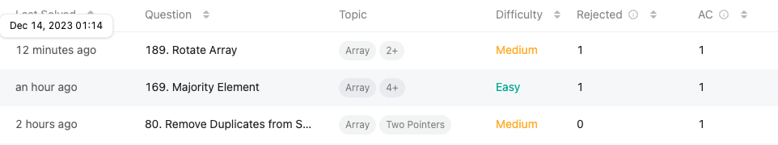
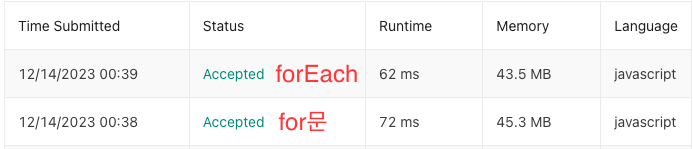

## **오늘의 코딩테스트 - 3 문제 완료**
{: height="300"} 

---

## **첫번째 문제 - [80. Remove Duplicates from Sorted Array II](https://leetcode.com/problems/remove-duplicates-from-sorted-array-ii/submissions/)**

#### **접근 방식**
이 문제는 오름차순으로 정렬된 배열에서 중복된 요소를 제거하는 것을 다룹니다. 각 고유 요소가 최대 두 번까지만 나타나도록 해야 한다. 이를 위한 접근 방식은 다음과 같다.  

1. **투 포인터 기법 사용**: 이 문제는 투 포인터 기법을 사용하여 효율적으로 해결할 수 있다. 하나의 포인터(`i`)는 순회를 위해 배열을 통과하고, 다른 하나의 포인터(`k`)는 중복이 없는 요소의 새 위치를 추적한다.
2. **중복 확인**: 배열이 정렬되어 있기 때문에, 현재 요소가 이전 요소와 같은지 확인할 수 있다. 그러나 각 요소가 최대 두 번까지 나타날 수 있으므로, 이전 요소와 비교할 때 한 단계 더 거슬러 올라가서 확인하는 거까지 확인한다.
3. **요소 이동**: 현재 요소가 중복을 초과하지 않으려면 `k` 위치에 해당 요소를 복사하고 `k`를 증가시킨다. 이렇게 하면 중복된 요소를 건너뛰고 `nums` 배열의 시작 부분에 중복이 없는 요소들이 위치하게 된다.
4. **결과 반환**: 모든 요소를 확인한 후 `k`의 값을 반환한다. 이 값은 중복을 제거한 후의 배열 길이를 나타낸다.

#### **작성한 코드**
```javascript
/**
 * @param {number[]} nums
 * @return {number}
 */
function removeDuplicates(nums) {
    let k = 2;
    
    for (let i = 2; i < nums.length; i += 1) {
        if(nums[i] != nums[k - 2] || nums[i] != nums[k - 1]){
            nums[k] = nums[i];
            k += 1;
        }
    }
    
    return k;
};
```

이유를 설명하기 전에 `++`과 `+= 1` 둘의 작동 차이를 알아보자.  
- **`i++` (단항 증감 연산자)**: 이것은 `i`의 현재 값을 사용한 후, 그 값을 1 증가시킨다.
- **`i += 1` (복합 할당자)**: 이 표현은 `i`의 값에 1을 더하고 결과를 다시 `i`에 할당한다. 이는 `i = i + 1`과 동일하다. 이 경우에는 `i`의 값이 즉시 1 증가한다.  
<br>

단항 증감 연산자(`++`, `--`)를 사용하지 말고 대신 `+= 1`, `-= 1`과 같은 연산자를 사용하도록 권장하는 이유는 주로 **코드의 명확성과 가독성** 때문이다.  
<br>

1. **명확성**: `++`나 `--` 연산자는 특히 후위 연산자(`i++`)의 경우, 해당 줄에서 값이 증가하거나 감소하는 시점이 명확하지 않을 수 있다. 이는 코드의 이해를 어렵게 만들고, 특히 복잡한 표현식에서는 오류의 원인이 될 수 있다. 반면, `+= 1`이나 `-= 1`은 명시적으로 해당 줄에서 즉시 연산이 수행된다는 것을 분명히 한다.
2. **가독성**: `+= 1`, `-= 1`과 같은 연산자는 읽는 사람에게 정확히 어떤 작업이 수행되는지 더 명확하게 전달한다. 코드를 읽는 사람이 해당 연산의 의도를 더 쉽게 이해할 수 있다.
3. **디버깅 용이성**: 디버깅 시 `+= 1`나 `-= 1`과 같은 연산자는 현재 값과 증가 또는 감소 후의 값을 분명하게 보여준다. 반면, `++`나 `--`는 이런 변화를 추적하기가 더 어려워질 수 있다.
4. **프로그래밍 언어의 차이**: 일부 프로그래밍 언어나 특정 상황에서는 `++`, `--` 연산자가 지원되지 않거나 예상치 못한 동작을 할 수 있다. 반면, `+= 1`, `-= 1`은 거의 모든 프로그래밍 언어에서 일관된 방식으로 작동한다.


<br>

## **두번째 문제 - [169. Majority Element](https://leetcode.com/problems/majority-element/?envType=study-plan-v2&envId=top-interview-150)**

#### **접근 방식**
이 문제는 주어진 배열에서 과반수를 차지하는 요소를 찾는 것이다. 이 문제를 풀기 위한 몇가지 접근 방식이 있으며, 그 중 가장 대표적인 것은 `보이어-무어 과반수 투표 알고리즘`이다. 이 알고리즘은 K명의 후보들이 N명에게 투표받을 때, 과반수 이상인 후보가 나오는지, 나온다면 그 후보가 어떤 후보인지 알아내는 알고리즘이다.  
이때 주의할 점은 이 알고리즘은 무조건 과반수 요소가 존재한다는 가정 하에 설계되었으므로, 그렇지 않은 경우에는 적절한 결과를 내지 못한다.

#### **작성한 코드**
```javascript
/**
 * @param {number[]} nums
 * @return {number}
 */
function majorityElement(nums) {
    const candidate = nums[0];
    let secondPerson = 0;
    let count = 1;
    
    for (let i = 1; i < nums.length; i += 1) {
        if (candidate === nums[i]) count += 1;
        else {
            secondPerson = nums[i];
        }
    }
    
    if (count > nums.length / 2) {
        return candidate;
    } else {
        return secondPerson;
    }
};
```

이렇게 풀게 되면, 제출했을 때의 테스트 케이스를 통과하지 못하게 된다. 왜냐하면 그 케이스는 서로 다른 숫자가 2개가 넘기 때문이다.  

그래서 다음과 같이 숫자가 여러 개일 경우를 생각해서 다시 코드를 짜보았다.
1. candidate와 count를 초기화한다.
2. 배열을 순회하면서, 각 요소를 확인한다.
  - 만약 count가 0이면, 현재 요소를 candidate로 설정한다.
  - 이후, 현재 요소가 candidate와 같으면 count를 증가시키고, 그렇지 않으면 감소시킨다.
3. 배열을 모두 순회한 후, candidate에 남은 요소가 과반수 요소이다.  

```javascript
function majorityElement(nums) {
  let candidate = 0;
  let count = 0;

  nums.forEach(num => { 
    if (count === 0) {
      candidate = num;
    }
    count += (num === candidate) ? 1 : -1;
  })

  return candidate;
}
```

이때, 나는 for문 대신에 forEach를 사용했다. for문을 썼다고 해서 나쁜 건 아니지만 airbnb 컨벤션에 고차함수를 사용하라고 나와있다. 아무래도 for문의 업그레이드 버전이 foEach이고, for문보다 forEach가 수행속도 측면 뿐만 아니라 다방면에서 좋다고 알고 있다.

이 문제에서 for문 대신에 forEach를 썼을 때 **Runtime과 Memory가 확실히 줄어든 것**을 확인할 수 있다.
{: height="250"}

<br>

## **세번째 문제 - [189. Rotate Array](https://leetcode.com/problems/rotate-array/?envType=study-plan-v2&envId=top-interview-150)**

#### **접근 방식**
이 문제는 정수 배열 `nums`를 오른쪽으로 `k` 단계만큼 회전시키는 것이다. 여기서 `k`는 음수가 아닌 정수이다.
1. temp에 nums 배열 마지막 숫자를 넣어놓는다.
2. nums 배열 마지막 - 1부터 이전 숫자를 대입한다.
3. 그리고 나서 temp에 저장된 숫자를 nums 배열 첫 번째에 넣는다.

#### **작성한 코드**
```javascript
/**
 * @param {number[]} nums
 * @param {number} k
 * @return {void} Do not return anything, modify nums in-place instead.
 */
function rotate(nums, k) {
    let temp = 0;
    
    for (let i = 0; i < k; i += 1){
        temp = nums[nums.length - 1];
        
        for (let j = nums.length - 1; j > 0; j -= 1) {
            nums[j] = nums[j-1];
        }
        nums[0] = temp;
    }
    
    
    return nums;
};
```

처음 푼 코드는 테스트 케이스는 통과했지만, 제출할 때 하는 테스트 케이스를 **Time Limit Exceeded**로 통과하지 못했다. 아무래도 **이중 for문**을 써서 그런 거 같다.  

그래서 풀이법을 찾아보니 아래와 같은 방법이 나왔다.  
1. **첫 번째 반복문**: 
  - 배열의 마지막 요소부터 시작하여, 각 요소를 `k`만큼 오른쪽으로 이동시킨다. 
  - `nums[i + k] = nums[i]` 이 부분에서 `i` 번째 요소를 `i + k` 위치로 이동시킨다.
  - 이 과정에서 새로운 위치에 요소들이 추가되기 떄문에 배열의 길이가 `k`만큼 늘어난다.

2. **두 번째 반복문**:
  - `k`번 회전이므로, 배열의 마지막 `k` 요소를 앞쪽으로 이동시켜야 한다.
  - `nums[j] = nums.pop()` 이 부분에서 배열의 마지막 요소를 `pop()` 함수를 이용하여 제거하고, 이를 앞부분에 넣는다.
  - 이 반복문은 `k`번 실행되어, 원래 배열의 마지막 `k` 요소를 배열의 시작 부분으로 이동시킨다.

```javascript
function rotate(nums, k) {
  for (let i = nums.length - 1; i >= 0; i -= 1) {
    nums[i + k] = nums[i];
  }

  for (let j = k - 1; j >= 0; j -= 1) {
    nums[j] = nums.pop();
  }
}
```

위 코드의 실행되는 **nums = [1, 2, 3, 4, 5, 6, 7]**이고 **k = 3**일 때, 예시를 들어보자면 다음과 같다.  

**첫 번째 반복문**  
nums: [1, 2, 3, 4, 5, 6, 7, _, _, **7**]  
nums: [1, 2, 3, 4, 5, 6, 7, _, **6**, 7]  
nums: [1, 2, 3, 4, 5, 6, 7, **5**, 6, 7]  
nums: [1, 2, 3, 4, 5, 6, **4**, 5, 6, 7]  
nums: [1, 2, 3, 4, 5, **3**, 4, 5, 6, 7]  
nums: [1, 2, 3, 4, **2**, 3, 4, 5, 6, 7]  
nums: [1, 2, 3, **1**, 2, 3, 4, 5, 6, 7]  

**두 번째 반복문**  
nums: [1, 2, **7**, 1, 2, 3, 4, 5, 6]  
nums: [1, **6**, 7, 1, 2, 3, 4, 5]  
nums: [**5**, 6, 7, 1, 2, 3, 4]  
