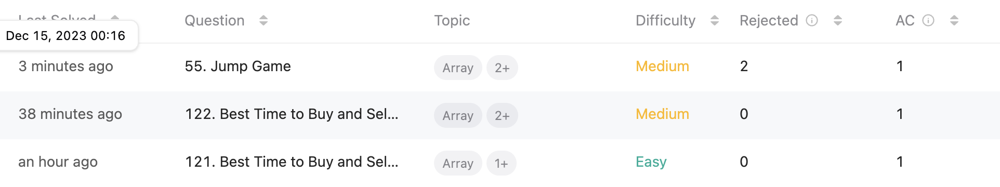

## **오늘의 코딩테스트 - 3 문제 완료**
{: height="300"} 

---

## **첫번째 문제 - [121. Best Time to Buy and Sell Stock](https://leetcode.com/problems/best-time-to-buy-and-sell-stock/)**

#### **접근 방식**
이 문제는 "주식을 사고 팔기 가장 좋은 시점 찾기"라고 불리는 고전적인 알고리즘 문제이다. 이 문제의 목적은 주어진 주식 가격 배열에서 최대 이익을 얻을 수 있는 구매일과 판매일을 찾는 것이다. 그래서 최대 이익을 출력해야 한다.

1. 현재 값과 다음 값의 차가 0보다 클 때, 현재까지의 최대 이익보다 크다면 그 값이 최대 이익 값이 된다.
2. 현재 값과 다음 값의 차가 0보다 작을 때, 이익이 나지 않기 때문에 비교할 값을 현재 값으로 바꾼다.

#### **작성한 코드**
```javascript
/**
 * @param {number[]} prices
 * @return {number}
 */
function maxProfit(prices) {
    let min = prices[0], difference = 0, profit = 0;
    
    for (let  i = 1; i < prices.length; i += 1) {
        if (prices[i] - min > 0 && prices[i] - min > profit) {
            profit = prices[i] - min;
        } else if (prices[i] - min < 0) {
            min = prices[i];
        }
    }
    
    return profit;
};
```

<br>

## **두번째 문제 - [122. Best Time to Buy and Sell Stock II](https://leetcode.com/problems/best-time-to-buy-and-sell-stock-ii/?envType=study-plan-v2&envId=top-interview-150)**

#### **접근 방식**
이 문제는 여러 번의 거래를 통해 주식으로부터 얻을 수 있는 최대 이익을 찾는 것이다. 주어진 주식 가격 배열에서 각 날짜마다 주식을 사고팔 수 있으며, 한 번에 하나의 주식만 보유할 수 있다. 또한, 같은 날에 주식을 사고 바로 팔 수도 있다. 

1. **누적 이익 계산**: 이전 날짜와 비교하여 오늘 주식 가격이 높을 때마다 이익을 누적한다. 즉, 주식 가격이 상승하는 모든 구간에서 이익을 얻는다.
2. **단순하고 효율적인 순회**: 배열을 한 번만 순회하면서, 각 단계에서 이전 날짜의 가격과 비교하여 오늘 가격이 더 높다면 차이를 이익에 더한다.
3. **최종 결과 반환**: 순회를 마치면 누적된 총 이익을 반환한다.

#### **작성한 코드**
```javascript
/**
 * @param {number[]} prices
 * @return {number}
 */
function maxProfit(prices) {
    let profit = 0;
    
    for (let i = 1; i < prices.length; i += 1 ) {
        if (prices[i] - prices[i-1] > 0) {
            profit += prices[i] - prices[i - 1];
        }
    }
    
    return profit;
};
```

<br>

## **세번째 문제 - [55. Jump Game](https://leetcode.com/problems/jump-game/?envType=study-plan-v2&envId=top-interview-150)**

#### **접근 방식**
이 문제는 주어진 정수 배열 `nums`를 사용하여 특정 규칙에 따라 배열의 마지막 인덱스에 도달할 수 있는지를 결정하는 문제이다. 배열의 각 요소는 해당 위치에서 할 수 있는 최대 길이를 나타낸다. 목표는 배열의 첫 번째 인덱스에서 시작하여 마지막 인덱스에 도달할 수 있는지 여부를 반환하는 것이다.

1. **최대 도달 가능 인덱스 추적**: 배열을 순회하면서 각 인덱스에서 도달할 수 있는 최대 인덱스를 계산한다. 이는 현재 인덱스와 그 인덱스에서의 최대 점프 길이를 더하여 얻을 수 있다.
2. **도달 불가 판단**: 순회하는 동안 현재 인덱스가 이전 단계에서 계산한 최대 도달 가능 인덱스보다 크면, 더 이상 진행할 수 없으므로 `false`를 반환한다.
3. **최종 결과 반환**: 배열의 마지막 인덱스에 도달하거나, 도달할 수 없는 경우가 확인되면 해당 결과를 반환한다.

#### **작성한 코드**
```javascript
/**
 * @param {number[]} nums
 * @return {boolean}
 */
function canJump(nums) {
    let maximum = nums[0];
    
    if (nums.length <= 1) {
        return true;
    }
    
    for (let i = 0; i < nums.length; i += 1) {
        if (maximum <= i && nums[i] === 0) {
            return false;
        }
        
        if (i + nums[i] > maximum) {
            maximum = i + nums[i];
        }
        
        if (maximum >= nums.length - 1) {
            return true;
        }
    }
    return false;
};
```
