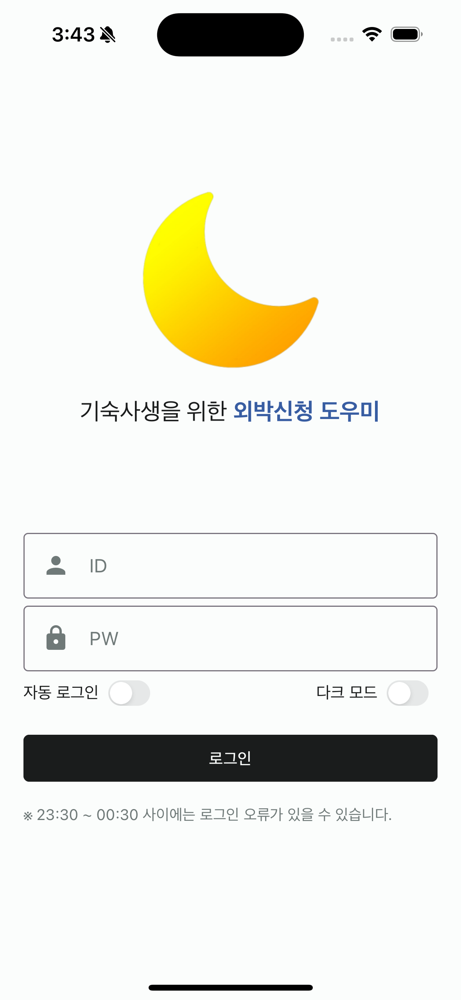

학교 기숙사 생활을 지원하는 앱 개발 과정에서, 사용자의 편의성을 최우선으로 고려하여 자동 로그인 기능과 함께 직관적인 로그인 및 로그아웃 인터페이스를 설계했습니다.  
이번 포스트에서는 React Native 환경에서 **Zustand와 AsyncStorage를 활용해 자동 로그인 기능을 구현**했던 사례와, **사용자 경험을 고려한 UI/UX 디자인 최적화** 과정을 공유하고자 합니다.  


## **로그인 로직**
자동 로그인 구현을 위해 다음과 같은 단계를 따릅니다:

1. **로그인 성공 시 사용자 정보 저장**: 사용자가 성공적으로 로그인하면, 로그인 상태(isAutoLogin)와 사용자 정보(ID와 비밀번호)를 안전하게 저장합니다.
2. **앱 재시작 시 로그인 상태 확인 및 자동 로그인 처리**: 앱이 재시작될 때, 저장된 로그인 상태를 확인하고, 해당 상태가 true이며 사용자 정보가 존재한다면 자동으로 로그인을 시도합니다.
3. **로그아웃 시 정보 초기화**: 사용자가 로그아웃을 진행할 경우, 저장된 모든 사용자 정보와 로그인 상태를 초기화합니다.

### **코드 예시**
아래는 **자동 로그인 구현을 위한 핵심 로직**입니다. 실제 구현에서는 사용자 정보를 안전하게 저장하고 관리하기 위한 방법을 고려해야 합니다.

```javascript
// 로그인 화면 로직 예시
const { autoId, autoPassword, isAutoLogin } = useAuthStore();
const [id, setId] = useState(autoId || '');
const [password, setPassword] = useState(autoPassword || '');

useEffect(() => {
  if (isAutoLogin && id && password) {
    onSubmitLoginForm();
  }
}, []);

const onSubmitLoginForm = async () => {
  try {
    const response = await getLogin({ id, password });
    // 로그인 성공 처리 로직
    // 사용자 정보와 로그인 상태 저장
  } catch (error) {
    // 에러 처리 로직
  }
};
```
<br>

그리고 아래는 Zustand 코드입니다.
```javascript
// 자동 로그인을 위한 store
// Zustand store 예시
export const useAuthStore = create<AutoLogin>()(
  persist(
    (set) => ({
      isAutoLogin: false,
      autoId: '',
      autoPassword: '',
      set: (newState) => set(newState),
    }),
    {
      name: 'authStore', // 스토어 이름
      storage, // AsyncStorage 사용
    },
  ),
);
```


## **보안상의 고려사항**
- **민감한 정보 암호화**: 사용자의 ID와 비밀번호와 같은 민감한 정보는 암호화하여 저장해야 합니다. 가능하다면 **'SecureStore'**와 같은 보안 스토리지를 사용하는 것이 좋다. 그래서 다음 스프린트로는 SecureStore를 사용하여 사용자 로그인 정보를 저장할 예정이다.
- **토큰 기반 인증 사용 고려**: 사용자의 로그인 정보 대신 토큰 기반 인증 방식을 사용하는 것을 고려하여 보안을 강화할 수 있습니다.  
<br>

## **로그인 및 로그아웃 UI/UX 디자인**
### **로그인**
{: width="300" height="300"}  
로그인 페이지는 앱의 첫 인상을 결정짓습니다. 사용자에게 친숙하고 안전한 사용 환경을 제공하기 위해 다음과 같은 디자인 요소를 포함시켰습니다: 

- **Header**: 앱 로고와 '기숙사생을 위한 외박신청 도우미'라는 문구를 포함하여, 앱의 목적을 간단하게 설명한다.
- **입력 필드**: ID와 비밀번호를 입력할 수 있는 란을 제공합니다. 이는 사용자가 앱에 로그인하는 데 필요한 기본 정보이다.
- **토글 스위치**: 자동 로그인 기능과 다크 모드 전환 기능을 위한 토글을 제공한다. 이는 사용자의 편의를 위해 추가된 기능이다.
- **로그인 버튼**: 사용자가 입력한 정보를 바탕으로 로그인 API를 호출할 수 있는 버튼이다.

이러한 요소들은 사용자가 앱에 쉽게 접근하고, 자신의 선호에 맞게 설정을 조정할 수 있도록 돕는다. 또한, 요소들을 이렇게 4개의 부분으로 나누어 개발함으로써 다른 개발자 분들이 봤을 떄, 이해하기 쉽도록 해준다.  

### **로그아웃**
{: width="300" height="300"}  
이 앱은 **기숙사 생활을 지원**하는 데 중점을 둔다. 사용자들은 주로 외박 신청이나 자신의 상벌점 내역 조회와 같은 기능을 사용하기 위해 앱을 찾는다. 이러한 사용 패턴을 고려할 때, 로그아웃은 자주 발생하는 작업이 아니다. 대부분의 사용자는 한 번 로그인한 후에는 앱을 지속적으로 사용하며, 로그아웃은 상대적으로 드문 경우에만 필요한 행동이 된다.  

이러한 **사용자의 행동 패턴과 앱의 목적을 고려**하여, 로그아웃 버튼을 설정 페이지의 맨 아래에 배치하기로 결정했다. 이 위치는 사용자가 필요할 때 쉽게 찾을 수 있으면서도, 앱 사용 중 로그아웃을 실수로 누르는 것을 방지하고, 앱의 주요 기능에 더 집중할 수 있도록 한다. 로그아웃 버튼의 이러한 배치는 사용자 경험을 최적화하려는 우리의 의도를 반영한다.   
<br>

## **결론**
앱 개발 과정에서 **사용자의 편의성과 보안을 동시에 고려**하는 것은 매우 중요합니다. 본 프로젝트에서 구현한 자동 로그인 기능과 **사용자 친화적인 UI/UX 디자인**은 기숙사 생활을 지원하는 앱의 사용성을 크게 향상시키는 데 기여했습니다. 앞으로도 사용자의 필요와 보안을 최우선으로 고려한 앱 개발을 지속해 나가겠습니다.  