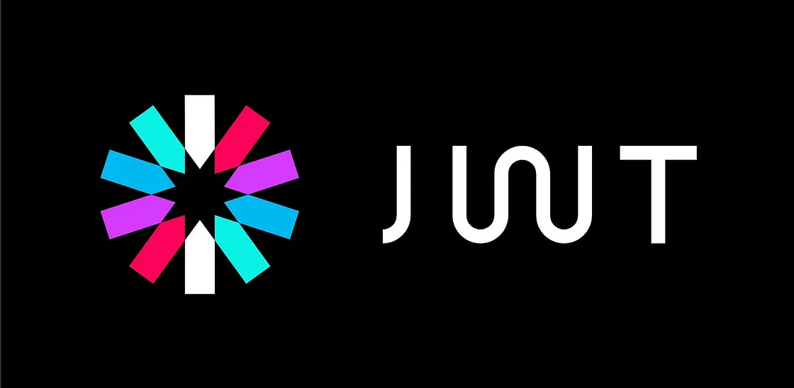

{: height="300"}

### **"코드의 알파벳": 자바스크립트에서의 토큰**  
**자바스크립트의 토큰은 코드를 구성하는 가장 작은 단위**인데, 이는 프로그래밍 언어의 알파벳과 같다. 키워드, 식별자, 리터럴, 세미콜론(;)이나 마침표(.) 등의 각각의 토큰이 모여 있는 코드 문자를 형성한다.  
 

예를 들어, `var age = 30;`라는 코드는 `var`, `age`, `=`, `30`, `;` 이렇게 **다섯 개의 토큰**으로 구성된다. 이들은 변수 선언, 값 할당 등 프로그램의 기본 작업을 수행하는 데 필요한 요소이다.  
 

### **"인증의 열쇠": JWT 토큰**  
반면에 **JWT(Json Web Token) 토큰은 웹 인증의 세계에서 중요한 역할**을 한다. 이 암호화된 문자열은 사용자의 신원 정보나 권한을 담고, 웹 애플리케이션의 안전한 정보 전송에 사용된다. **JWT는 헤더, 내용(payload), 서명(Signature)의 세 부분**으로 나뉘며, 각 부분은 점(.)으로 구분된다. JWT는 사용자의 신원을 확인하고 웹 애플리케이션 간 안전하게 정보를 전달하는 데 중요한 역할을 한다.  
 

### **두 토큰의 차이점 이해하기**  
비록 두 용어 모두 토큰이라고 불리지만, 자바스크립트 토큰과 JWT 토큰은 서로 다른 개념이다. 자바스크르비트 토큰은 프로그래밍 언어의 기본 구성 요소를 의미하고, JWT 토큰은 웹 인증과 데이터 전송에 사용되는 암호화된 문자열을 말한다.  

이 두 개념을 명확히 이해하면, 웹 개발과 프로그래밍을 더 깊이 이해하고 효과적으로 활용할 수 있을 것 같다.
