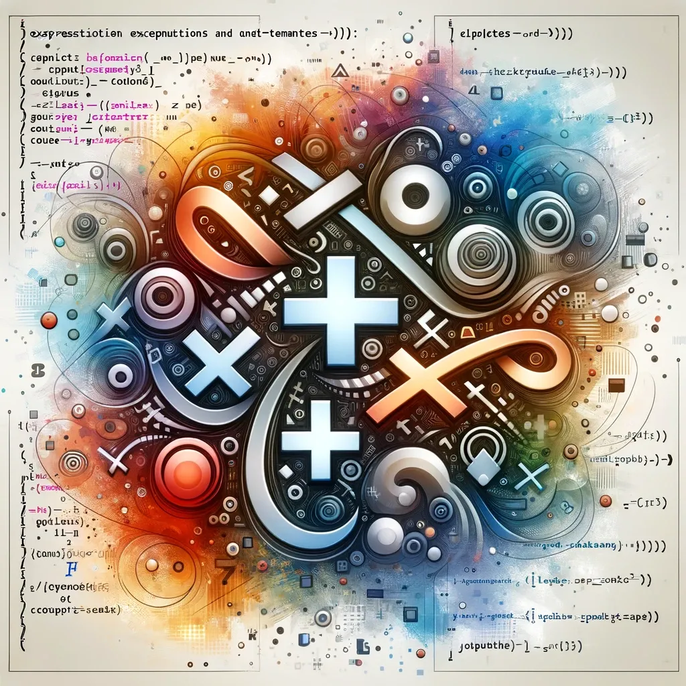

**표현식**은 **값으로 평가될 수 있는 문**이다.  
표현식은 하나의 값으로 해석될 수 있는 모든 것을 의미한다. 표현식은 문자열, 숫자, 논리값, 복잡한 계산식, 함수 호출 등 다양한 형태를 취할 수 있다.  
 

### **표현식인 문**  
**표현식인 문은 그 자체로 표현식이면서, 프로그램의 실행 흐름을 미칠 수 있는 문**이다. 이러한 문은 표현식의 결과로 어떤 동작을 수행한다. 대표적인 예시는 다음과 같다.  

1. **할당 표현식**: 변수에 값을 할당하는 문이다.  
  ex) `a = 5;` `b = a + 3;`

2. **함수 호출 표현식**: 함수를 호출하는 문이다.  
  ex) `console.log('Hello');` `myFunction(3, 4);`

3. **증감 표현식**: 변수의 값을 증가시키거나 감소시키는 문이다.  
  ex) `counter++;` `i--;`

4. **객체/배열 초기화 표현식**: 객체나 배열을 초기화하는 문이다.  
  ex) `let obj = { name: 'John', age: 30 };`, `let array = [1, 2, 3];`
  

 

### **표현식이 아닌 문**  
**표현식이 아닌 문은 독립적으로 동작을 수행하며, 값을 반환하지 않는다.** 이들은 프로그램의 구조를 정의하거나 특정 조건에 따라 코드의 실행 흐름을 제어한다. 대표적인 예시는 다음과 같다.  

1. **변수 선언문**: 변수를 선언하는 문이다.  
  ex) `let x;`, `const y = 10;`

2. **조건문**: 특정 조건에 따라 다른 코드 블록을 실행한다.  
  ex) `if (x > 5) {...}`, `switch(key) {...}`
  
3. **반복문**: 특정 조건이 만족될 때까지 코드 블록을 반복적으로 실행한다.  
  ex) `for (let i = 0; i < 10; i++) {...}`, `while (condition) {...}`

4. **함수 선언문**: 함수를 선언한다.  
  ex) `function myFunction(a, b) {...}`

5. **제어문**: 코드의 실행 흐름을 제어하는 문이다.  
  ex) `break`, `continue`

 

### **결론**  
표현식인 문과 표현식이 아닌 문의 차이는 주로 **그들이 값을 반환하느냐(표현식인 경우)**, 아니면 **특정 동작을 수행하고 값을 반환하지 않느냐(표현식이 아닌 경우)**에 있다. 이러한 이해는 JavaScript 프로그래밍에서 코드의 동작 방식을 파악하는데 도움이 된다.