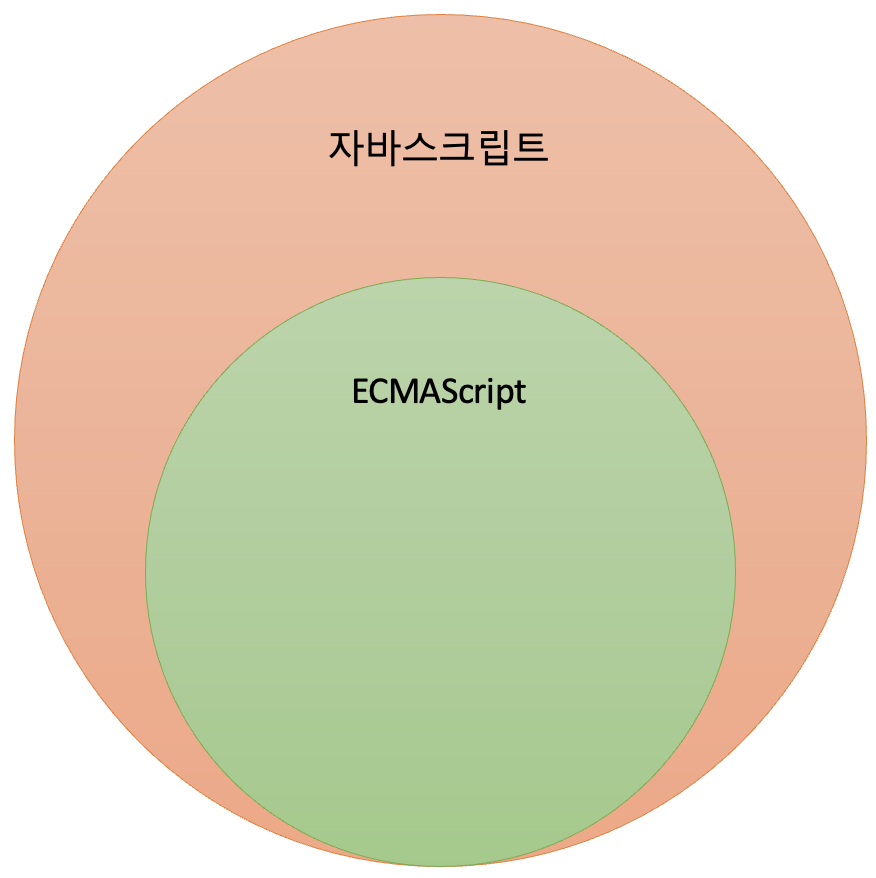

# **1장 프로그래밍**
## **프로그래밍이란 무엇인가?**
**프로그래밍**이란 컴퓨테에게 실행을 요구하는 **일종의 커뮤니케이션** 방식이다. 이 과정에서 중요한 것은 **문제 해결 능력**으로, 프로그래밍을 시작하기 전에 해결하고자 하는 문제를 명확하게 이해하고 적절한 해결 방안을 정의해야 한다.  
 

## **프로그래밍의 핵심 단계**
대부분의 문제(요구사항)는 복잡하며 명확하지 않을 수도 있다. 따라서 아래 내용을 따라야 한다.
1. **문제 이해**: 문제(요구사항)를 정확하게 파악한다.
2. **분해와 정리**: 복잡한 문제를 간단한 단위로 나누고, 데이터를 정리 및 분류한다.
3. **행위 배열**: 필요한 동작들을 순서대로 배열한다.

프로그래밍의 결과물은 **코드**이며, 이는 컴퓨터가 이해할 수 있도록 정확하고 상세하게 작성되어야 한다.  
 

## **컴퓨터와 커뮤니케이션을 하기 위해서는 아래 사항을 주의하자**
- **컴퓨터는 명확한 지시가 필요하다**: 컴퓨터는 추측이나 애매한 지시를 이해할 수 없다.
- **Computational thinking(컴퓨팅 사고)**: 컴퓨터의 관점에서 문제를 바라보고 해결해야 한다.  
 

## **프로그래밍 언어의 중요성**
- **사람과 컴퓨터 사이의 번역기(컴파일러, 인터프리터)**: 사람이 이해할 수 있는 언어로 작성된 코드를 컴퓨터가 이해할 수 있는 형태로 변환한다.
- **프로그래밍 언어의 구성 요소**: 구문(syntax)과 의미(semantics)의 조합으로 이루어짐  
 

## **프로그래밍 언어의 주요 구성 요소**
1. **변수와 값**: 데이터를 저장하고 참조한다.
2. **연산자**: 데이터를 연산하고 평가한다.
3. **조건문**: 조건에 따라 코드 실행을 분기한다.
4. **반복문**: 조건을 만족할 때까지 코드를 반복한다.
5. **함수**: 재사용 가능한 코드 블록을 만든다.
6. **객체와 배열**: 데이터를 구조화한다.  
 

> **결론적으로, 프로그래밍은 요구사항을 분석하여 적절한 자료구조와 함수로 변환하고, 그 흐름을 제어하는 과정이다.**

# **2장 자바스크립트란?**
## **자바스크립트의 탄생**
1995년, 넷스케이프 커뮤니케이션즈는 웹페이지의 보조적 기능을 위해 브렌던 아이크가 개발한 자바스크립트를 도입했다. 처음엔 **"Mocha"**로 명명되었다가, **"LiveScript"**를 거쳐 **"JavaScript"**로 최종 명명되었다.  
 

> **자바스크립트가 어떤 언어의 영향을 받았을까?**  
  자바스크립트는 C/C++의 구문을 예상하고 있을 개발자들을 대상으로 만들어졌다.
  넷스케이프사는 자바와 밀접하게 연결된 자바스크립트가 자바의 문법과 유사하길 희망했다.
  그래서 문법은 유사하지만, 둘은 다른 언어이다.
{: .prompt-info }

> **왜 자바스크립트라는 이름을 사용했을까?**   
  JavaScript라는 이름이 사용된 이유는 언어가 Java 개발자들을 타깃으로 하고 있었고, **당시에 경량 프로그램을 지칭하기 위한 단어로 script가 많이 사용**되었기 때문이다.  
  **즉, JavaScript는 당시의 무겁고 잘 알려진 Java를 대체하는 언어로 자리매김하조가 사용된 마케팅 전략이었다.**
{: .prompt-info }

 

이렇게 탄생한 자바스크립트가 탄생한 뒤 얼마 지나지 않아 자바스크립트의 파생 버전인 **JScript가 출시되어** 자바스크립트는 위기를 맞는다.  

## **자바스크립트의 표준화**
- **JScript와 자바스크립트의 크로스 브라우징 이슈**: 1996년, 마이크로소프트는 JScript를 인터넷 익스플로어에 도입하면서 브라우저 호환성 문제가 발생했다.
- **ECAMScript 표준화**: 넷스케이프는 이러한 파편화를 방지하고자 ECMA 인터내셔널에 자바스크립트의 표준화를 요청했고, 이로 인해 ECMAScript라는 표준이 탄생했다. 이를 완성되었을 때, 상표권 문제로 자바스크립트를 ECMAScript로 명명되었다.
- **중요한 발전**: 2009년 **ECMAScript 5(ES5)**와 2015년 **ECMAScript 6(ES6)**가 발표되었으며, ES6는 let, const, 화살표 함수, 클래스, 모듈 등을 도입해 자바스크립트를 범용 프로그래밍 언어로 발전시켰다.

## **자바스크립트 성장의 역사**
### **Ajax**
- **Ajax의 등장**: 1999년, Ajax가 XMLHttpRequest의 형태로 도입되었다. 이는 서버와 **비동기적으로 데이터를 교환**하고, 부분적인 페이지 렌더링을 가능하게 했다.
- **Google Maps의 영향**: 2005년 구글 맵스는 Ajax를 이용한 웹 애플리케이션의 가능성을 보여주었다.
- **Ajax의 장점**: Ajax는 효율적인 데이터 교환과 부분 렌더링이 가능하다.
- **Ajax의 단점**:
  - Ajax는 클라이언트가 서버에 데이터를 요청하는 **클라이언트 풀링 방식**을 사용하므로, 서버 푸시 방식의 실시간 서비스는 만들 수 없다.
  - Ajax로는 바이너리 데이터를 보내거나 받을 수 없다.
  - Ajax 스크립트가 포함된 서버가 아닌 다른 서버로 Ajax 요청을 보낼 수는 없다.
  - 클라이언트의 PC로 Ajax 요청을 보낼 수는 없다.

> **클라이언트 풀링(client pooling) 방식**이란? <u>사용자가 직접 원하는 정보를 서버에게 요청하여 얻는 방식</u>을 의미한다.  
이에 반해 **서버 푸시(server push) 방식**이란 <u>사용자가 요청하지 않아도 서버가 알아서 자동으로 특정 정보를 제공하는 방식</u>을 의미한다. 
요즘 많이들 사용하는 스마트 폰에서 각종 앱이 보내는 푸시 알림이 서버 푸시 방식의 대표적인 예다.
{: .prompt-info }

> **pooling, pulling, polling의 차이**  
**pooling이란?**  
- 의미: Pooling은 자원을 풀(pool) 형태로 관리하는 것을 의미한다. 풀은 사전에 생성된 자원의 집합을 말하며, 필요할 때마다 이 풀에서 자원을 가져와 사용한다.
- 응용: '데이터베이스 연결 풀링'은 데이터베이스 연결을 미리 만들어 두고 필요할 때 재사용하는 것이다. 이 방법은 리소스 생성과 소멸에 대한 비용을 줄여 성능을 향상시킨다. 
> 
**pulling이란?**  
- 의미: Pulling은 '당기다' 또는 '끌어당기다'라는 의미를 가지며, 특정 작업이나 데이터를 요청하는 행위를 의미한다.
- 응용: 클라이언트가 서버로부터 정보나 데이터를 요청하고 받아오는 과정을 말한다.
> 
**polling이란?**  
- 의미: Polling은 주기적으로 특정 조건이나 상태의 변화를 확인하기 위해 반복적으로 체크하는 방법을 말한다.
- 응용: 서버에 데이터가 준비되었는지 주기적으로 요청을 보내는 것을 말한다.
{: .prompt-info }

### **jQuery**
**jQuery는 2006년에 등장한 JavaScript 라이브러리**입니다. 이 라이브러리는 웹 개발자들이 HTML 문서 탐색, 이벤트 처리, 애니메이션 생성 및 Ajax 애플리케이션을 쉽게 구축할 수 있도록 설계되었습니다. **jQuery의 가장 큰 장점 중 하나는 크로스 브라우징 호환성입니다.** 즉, 다양한 브라우저에서 동일한 코드가 일관된 방식으로 작동하도록 지원합니다. 이는 웹 개발의 복잡성을 줄이고 개발 속도를 향상시켜 줍니다.  
 

### **V8 자바스크립트 엔진**
- **V8의 등장과 영향**: 2008년, 구글의 V8 엔진은 **JIT(Just In Code) 컴파일을 도입**하여 자바스크립트의 성능을 획기적으로 개선했다. 이로 인해 자바스크립트는 웹 애플리케이션 개발에 더욱 활발히 사용되기 시작했다.
- **V8 엔진의 개발 환경**: V8 엔진은 C++로 개발하였고, Node JS 런타임 및 Chrome 브라우저에서 사용되고 있다.
 

> **V8 엔진이 왜 만들어졌을까?**  
V8은 웹 브라우저 내부에서 자바스크립트 수행 속도의 개선을 목표로 처음 고안되었다.  
이전에 여러 자바스크리브 엔진이 사용되고 있었지만, <u>다른 자바스크립트 엔진</u>은 웹 특성상 유저와 상호작용을 위해 **즉시성이 있는 인터프리터 방식**을 사용하는데, 이는 <u>코드가 많아질수록 속도가 느려진다는 단점</u>이 있다. 이점을 보완해서 속도 향상을 위해 v8 엔진은 인터프리터를 사용하는 것 대신에 **JIT(Just In Time) 컴파일러를 구현함**으로써 코드 실행 시에 자바스크립트 코드를 머신 코드로 컴파일한다.
{: .prompt-info }

> **JIT(Just In TIme) 컴파일이란?**   
**동적 번역으로, 프로그램을 실제 실행하는 시점에 기계어로 번역하는 컴파일 기법이다.** 이는 실행 시점에서 인터프리트 방식을 기계어 코드를 생성하면서 그 코드를 캐싱하여, 같은 함수가 여러 번 불릴 때 매번 기계어 코드를 생성하는 것을 방지한다.  
**이는 자바스크립트를 바이트코드로 컴파일하고 실행하는 방식**이다. 추가적인 속도향상을 위해 인라인 캐싱과 같은 최적화 기법을 적용하였다.
{: .prompt-info }

### **Node.js**
- **Node.js의 탄생**: 2009년, Node.js는 V8 엔진을 기반으로 한 서버 사이드 자바스크립트 실행 환경을 제공했다. 이는 자바스크립트를 브라우저 밖에서도 사용할 수 있게 만들며, <u>프론트엔드와 백엔드 모두에서 자바스크립트를 사용하는 동형성을 가능하게 했습니다.</u>
- **다양한 용도**: Node.js는 웹 서버 구축, RESTful API 개발, 실시간 통신 애플리케이션 구축 등 다양한 서버 사이드 애플리케이션 개발에 사용됩니다.
- **비동기 I/O 처리**: **비동기 I/O와 이벤트 기반 아키텍처를 사용하여 높은 성능을 제공한다는 점**입니다. 이는 데이터를 실시간으로 처리하는 애플리케이션에 적합하며, Node.js의 등장으로 자바스크립트는 서버 사이드 프로그래밍 언어로도 사용될 수 있게 되었습니다.
- Node.js는 **서버 사이드 애플리케이션 개발을 위한 더 광범위한 기능과 환경을 제공**합니다
 

### **SPA 프레임워크**
- **SPA의 대중화**: Angular, React, Vue 등과 같은 SPA 프레임워크가 등장하면서, **CBD(컴포넌트 기반의 개발 방법론)**이 대중화되었습니다.
- **동적인 부분의 효과적인 처리**: 이러한 프레임워크들은 **사용자 인터페이스를 구성하는 재사용 가능한 컴포넌트를 기반**으로 하며, 사용자 경험을 개선하고 개발 과정을 효율화합니다. 
- SPA 프레임워크는 웹 페이지가 새로 로딩되지 않고도 필요한 부분만 동적으로 갱신되도록 하여, 애플리케이션의 반응 속도를 높이고 사용자 경험을 개선합니다.

> **CBD란?**  
컴포넌트를 조합해 재사용함으로써 **개발 생산성과 품질을 높이고 시스템 유지보수 비용을 최소화할 수 있는 개발방법론**이다.
{: .prompt-info }
 

## **자바스크립트와 ECMAScript**
- **자바스크립트 정의**: 자바스크립트는 ECMAScript와 브라우저가 제공하는 클라이언트 사이드 Web API 등을 포함한 개념입니다. 
- **ECMAScript 정의**: ECMAScript는 자바스크립트의 핵심 문법과 기능을 정의하는 국제 표준으로, 자바스크립트의 버전 관리와 표준화를 담당합니다

{: width="300" height="300"} 
 

## **자바스크립트 특징**
자바스크립트는 HTML, CSS와 함꼐 웹을 구성하는 요소 중 하나로, 웹 브라우저에서 동작하는 유일한 프로그래밍 언어이다. 또한, 이는 개발자가 별도의 컴파일 작업을 수행하지 않는 인터프리터 언어이다.

- **웹의 핵심 언어**: 자바스크립트는 웹 브라우저에서 동작하는 유일한 프로그래밍 언어이다.
- **인터프리터 언어**: 개발자가 별도의 컴파일 작업을 수행하지 않는다.
- **멀티 패러다임 언어**: 명령형, 함수형, 프로토타입 기반 객체 지향 프로그래밍을 지원한다. 이는 클래스 기반 객체 지향 언어보다 효율적이면서 강력한 프로토타입 기반의 객체 지향 언어이다.  
 

**컴파일 언어와 인터프리터 언어의 차이**

**컴파일러 언어**|
:---|
코드가 실행되기 전 단계인 **컴파일 타임에 소스코드 전체를 한번에 머신 코드로 변환한 후 실행**한다. 머신 코드란 CPU가 바로 실행할 수 있는 기계어이다.|
실행 파일을 생성하지 않는다.|
**컴파일 단계와 실행 단계가 분리**되어 있다.  명시적인 컴파일 단계를 거치고, 명시적으로 실행 파일을 실행한다.|
**실행에 앞서 컴파일은 단 한번 수행**된다.|
**컴파일과 실행 단계가 분리되어 있으므로 코드 실행 속도가 빠르다.**|

**인터프리터 언어**|
:---|
코드가 실행되는 단계인 **런타임에 문 단위로 한 줄씩 중간 코드인 바이트 코드로 변환한 후 실행**한다. 바이트 코드란 특정한 하드웨어가 아니라 가상 머신에서 실행하도록 만든 바이너리 코드이다.|
**인터프리트 단계와 실행 단계가 분리되어 있지 않다.** 인터프리트는 한 줄씩 바이트코드로 변환하고 즉시 실행한다.|
**코드가 실행될 때마다 인터프리트 과정이 반복 수행**된다.|
인터프리트 단계와 실행 단계가 분리되어 있지 않고 **반복 수행되므로 코드 실행 속도가 비교적 느리다.**|  

 

# **참고자료**
> **자바스크립트 역사 참고**:   
> <https://wit.nts-corp.com/2014/08/13/1925>  
> <https://gladi.tistory.com/3>  
> 
> **Ajax 참고**:  
> <https://tcpschool.com/ajax/ajax_intro_basic>   
>
> **jQuery 참고**:  
> <https://jquery.com/>  
>
> **V8 엔진 참고**:  
> <https://ko.wikipedia.org/wiki/V8_(%EC%9E%90%EB%B0%94%EC%8A%A4%ED%81%AC%EB%A6%BD%ED%8A%B8_%EC%97%94%EC%A7%84)>  
> <https://velog.io/@remon/V8-%EC%97%94%EC%A7%84%EC%9D%B4-%EB%8C%80%EC%B2%B4-%EB%AD%90%EC%95%BC>  
> 