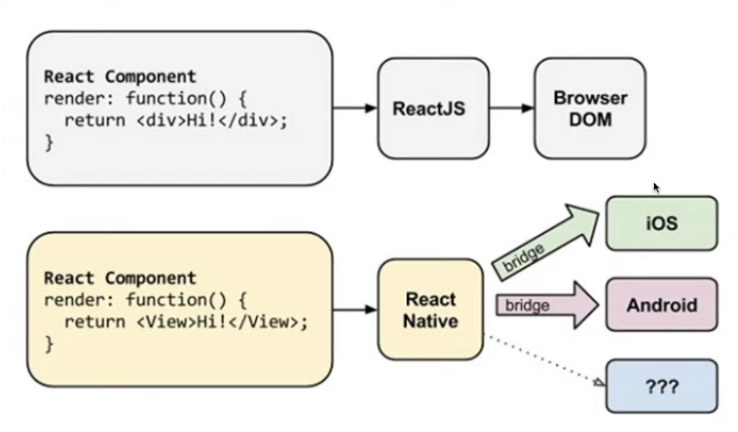

## Introduction
본 강의를 효과적으로 수강하려면 React의 기본 개념인 **state, props, useEffect, useState**에 대한 이해가 필요하다.

## React Native의 구조
React Native는 순수 JavaScript로만 구성된 것이 아니다. 가장 핵심적인 부분은 Bridge를 통해 코드가 운영체제와 통신하는 인프라다. 일반적으로 Java와 Xcode를 사용하여 이 인프라를 구성하고, apk나 ipa 파일로 변환 후 앱 스토어에 배포한다. 하지만 본 강의에서는 이러한 과정이 필요 없다. 이미 몇몇 개발자들에 의해 앱이 구축되었으며, **App Store**와 **Google Play Store**를 통해 설치할 수 있다. 앱에는 **JavaScript**와 **Markup/Styling**을 제외한 모든 요소가 포함되어 있다.

<expo.dev>

Expo를 사용하면, 별도의 시뮬레이터 설치 없이도 앱에서 코드의 결과를 바로 확인할 수 있다. 이를 위해 우선 `npm install --global expo-cli` 명령어로 Expo CLI를 설치하고, Mac 사용자의 경우 `Watchman`을 별도로 다운로드한다.

> **Watchman이란?**  
**Watchman**은 **페이스북에서 제작한 파일 시스템 변경 감지 도구**이다. 이는 React를 기반으로 하는 React Native는 코드가 변경되기만 해도 바로 자동으로 내용이 적용되는 Fast Refresh 기능을 제공하기 때문에 이러한 기능을 수행하기 위해 필요하다. 즉, **특정 폴더나 파일을 감시하다가 변화가 생기면, 특정 동작으로 실행하도록 설정하는 역할을 한다.**  
{: .prompt-tip }

설치 방법은 아래와 같다:

```shell
Copy code
$ brew update
$ brew install watchman
```

설치 후, Google Play Store에서는 `Expo`, App Store에서는 `Expo Go` 앱을 다운로드하여 로그인한다.

본 코스에서는 Expo를 사용해 React Native 코드를 바로 핸드폰으로 전송, 실시간으로 미리보기를 할 수 있다.


## How Does React Native Work

{: width="300" height="300"} 

React Native는 모바일 웹 사이트처럼 동작하지 않으며, 브라우저가 없다. 대신, React Native는 운영체제(iOS, 안드로이드)와 인터페이스를 통해 통신한다. 이 때, 코드는 iOS 코드나 Java Android로 변환되어 실행된다. 예를 들어, 버튼을 만들 때 React Native는 iOS와 안드로이드 각각에게 '버튼을 만들어주세요'라고 요청한다.

{: width="300" height="300"} 

이 그림은 React Native의 작동 원리를 보여준다. Native, Bridge, JavaScript 세 부분으로 나누어져 있으며, 우리는 주로 JavaScript 부분에 집중할 것이다. 과정은 다음과 같다:

1. 이벤트 발생 (예: 버튼 클릭)
2. 이벤트 관련 데이터 수집
3. 이 데이터로 JSON 메시지 생성
4. 우리의 코드가 이 정보를 받아 처리
5. 처리 결과를 다시 네이티브에 전달

## Creating The App
이제 날씨 앱과 Todo 앱을 만들어 보겠다.  
`expo init NomadWeather` 명령어로 프로젝트를 생성하고, 그 프로젝트를 열고 터미널에 `expo login`을 통해서 컴퓨터와 핸드폰에 동일한 아이디/비밀번호로 로그인하고, `npm start`를 입력한다.  
생성된 QR 코드를 스캔하면 React Native 코드가 실행되는 앱을 볼 수 있다.
