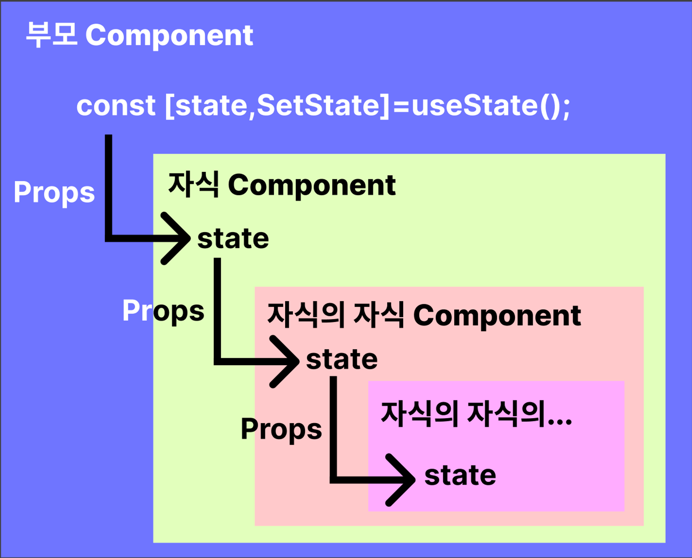
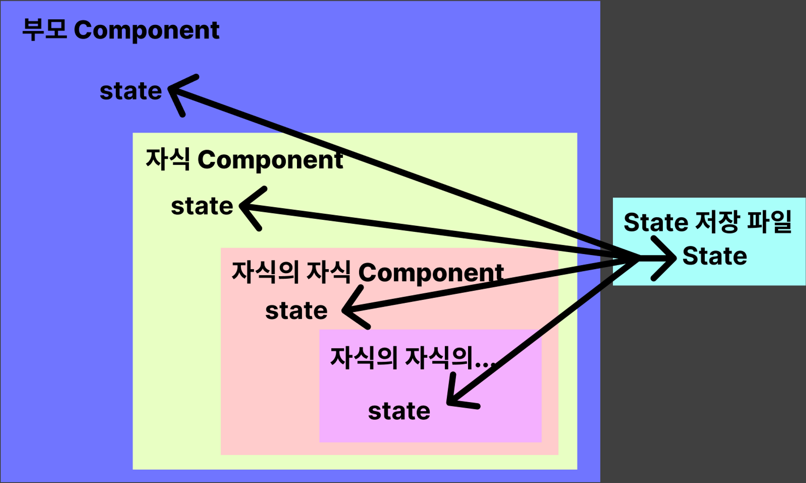
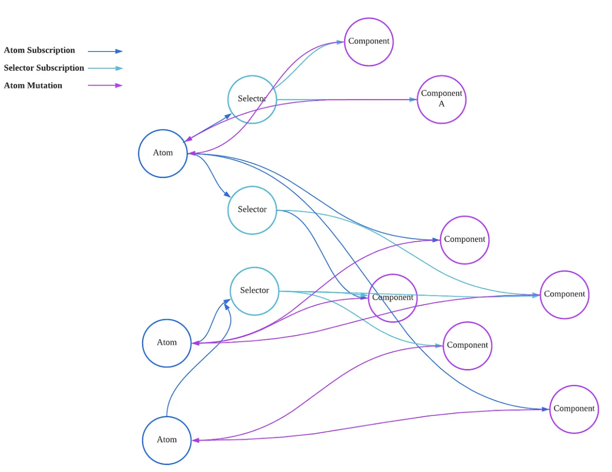
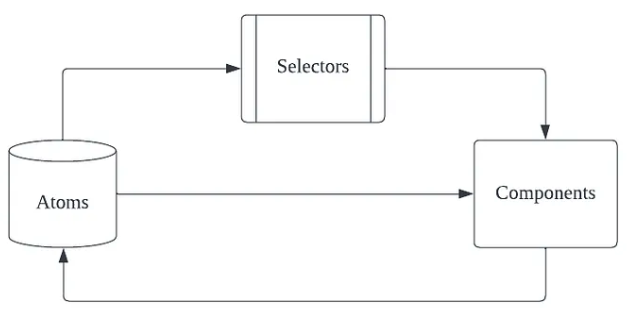

# **상태관리 라이브러리란 무엇일까?**

**상태관리 라이브러리**는 State를 관리해주는 라이브러리를 말한다. State는 한글로 ‘상태값’이라고 하며 일종의 변수와 같은 것이다. React에서는 일반적인 변수들은 아무리 바뀌어도 재렌더링되지 않지만, State는 바뀔 때마다 다시 렌더링되기 때문에 중요한 변수들은 State를 사용하게 됩된다.  

React Hooks의 useState를 사용해 State를 선언하는 문법은 아래와 같다.  
```javascript
// state는 현재값, setState는 setter 함수
const [state, setState] = useState("초기값");
```
<br>

# **그렇다면 상태관리 라이브러리를 사용하지 않으면 어떻게 될까?**

상태관리 라이브러리를 사용하지 않을 경우, State 값을 여러 컴포넌트에서 사용하려면 Props를 이용해 부모 컴포넌트에서 자식 컴포넌트로 값을 전달해야 한다. **Props는 컴포넌트 간에 값을 전달하는 수단으로, 함수의 파라미터와 비슷한 역할을 한다.**  

Props의 기본 사용법은 다음과 같다.
```javascript
// App.jsx
import React, {useState} from 'react';
import Hello from './Hello';

function App() {
  const [name, setName] = useState("");

  return (
    <Hello name={name} /> // name 속성을 자식 컴포넌에 전달함
	);
}

export default App;
```

```javascript
// Hello.jsx
import React from 'react';

function Hello(props){
  // name이라는 state를 props.name으로 받아옴
  return <div>안녕하세요 {props.name} </div>
}

export default Hello;
```  
<br>

만약 자식의 자식 컴포넌트에서 State를 사용하려면 부모 컴포넌트에서 자식 컴포넌트로 props를 넘겨주고, 자식 컴포넌트에서 다시 자식의 자식 컴포넌트로 props를 넘겨주어야 한다.  
이렇게 props로 값을 넘겨받은 후, 다시 넘겨주어야 하는 과정은 번거롭다. 게다가 자식 컴포넌트에서 부모의 state를 변경하고자 할 때도 props는 읽기 전용이므로 복잡한 과정을 거쳐야 한다.  

{: width="300" height="300"}

<br>

# **그러면 상태관리 라이브러리를 사용했을 때의 이점은?**

상태관리 라이브러리를 사용하면, 한 파일에 State를 모아두고 어디에서든지 해당 State를 사용할 수 있다. 즉, State를 부모 컴포넌트에서 자식 컴포넌트로 props로 넘겨주지 않아도 된다.  
또한, 상태관리 라이브러리는 props와 달리 읽기와 쓰기 모두가 가능하다. 따라서 자식 컴포넌트에서 부모 State를 직접 변경할 수 있으며, 해당 State가 변경되면 구독하는 모든 컴포넌트가 자동으로 재렌더링된다. 이를 통해 State를 좀 더 효율적으로 관리할 수 있으며, 컴포넌트 간의 연결고리를 간단한게 만들 수 있다.  

{: width="300" height="300"}

이렇게 상태 관리 라이브러리를 사용하면 State 관리가 매우 쉬워진다. Recoil은 이러한 상태 관리 라이브러리 중 하나이며, State를 효과적으로 관리할 수 있다. 이제 Recoil을 어떻게 사용하는지 자세히 알아보도록 하자.  
<br>

# **Recoil이란?**

Recoil은 문법이 React Hooks와 유사하며, 현재 업계에서 많이 사용중인 Redux보다 사용하기 쉬운 상태관리 라이브러리이다. Recoil의 세팅부터 atom, selector까지 알아보자.

## **data-flow graph**

다음은 Recoil 상태와 컴포넌트 관계이다.

{: width="300" height="300"}

다음은 Recoil의 데이터 흐름이다. 이를 보면 알 수 있듯이 상태 데이터가 atoms → selectors → component 순서로 흐른다.

{: width="300" height="300"}

<br>

# **Recoil 세팅을 해보자.**

먼저 Recoil을 사용하기 위해서는 설치가 필요하다.

`npm install recoil` or `yarn add recoil`  

다음으로, Recoil을 사용하기 위해서는 루트 컴포넌트에서 `<RecoilRoot>`를 사용해야 한다. `<RecoilRoot>`를 사용하는 가장 좋은 곳은 root component이다.  

아래 예시에서는 두 라우트를 가진 페이지가 있다. 

```javascript
// App.jsx
import React from 'react';
import {BrowserRouter as Router, Routes, Route} from 'react-router-dom';
import {RecoilRoot} from 'recoil';

import MainPage from './pages/MainPage';
import MyPage from './pages/MyPage';

function App() {
  return (
    <RecoilRoot> 
      <Router>
        <Routes>
          <Route path="/" element={<MainPage/>}/>
          <Route path="/my" element={<MyPage/>}/>
        </Routes>
      </Router>
    </RecoilRoot>
  );
}

export default App;
```

이렇게 설정했다면, Recoil을 사용할 준비가 완료되었다. 먼저 Atom에 대해 알아보자.  
<br>

## **Atom이란?**

Atoms는 상태(state)의 일부를 나타낸다. Atoms는 어떤 컴포넌트에서나 읽고 쓸 수 있다. Atom은 아래와 같이 선언할 수 있다.  

```javascript
const infoState = atom ({
  // key는 atom의 고유한 식별자로서, 
  // 다른 atom이나 selector와 중복되면 안된다.
  key: 'infoState', 
  default: '', // default는 atom의 초기값을 말합니다.
});
```

atom.js 파일을 생성하고, Recoil의 atom function을 사용하여 필요한 데이터를 설정한다. atom은 두 가지를 요구하는데, 첫 번째는 `key(고유값)`로 unique ID이고, 두 번째는 `default value(기본값)`이다.  
<br>

여러 컴포넌트에서 atom을 구독하고 있다면, 상태가 바뀌면 바뀐 값으로 해당 컴포넌트들이 `re-render`된다.  

```javascript
// atom.js
import {atom} from 'recoil';

export const titleState = atom<string>({
  key: 'titleState',
  default: '',
});
export const infoState = atom<string>({
  key: 'infoState',
  default: '',
});
```

```javascript
// MyPage.jsx
import React, {useEffect, useState} from 'react';
import {useRecoilState} from 'recoil';
import {titleState, infoState} from '../Recoil';

function MyPage(){
  const [title, setTitle] = useRecoilState(titleState);
  const [info, setInfo] = useRecoilState(infoState);

  // 제목 변경 함수
  const handleTitleChange = (e: React.ChangeEvent<HTMLInputElement>) => {
    setTitle(e.target.value);
  }
	
  // 내 소개 변경 함수
  const handleInfoChange = (e: React.ChangeEvent<HTMLInputElement>) => {
    setInfo(e.target.value);
  }
	
  return(
    <div>
      {/*텍스트 구역*/}
      <div>
        {/*제목 상자*/}
        <input
          autoFocus
          id="title"
          type="text"
          placeholder="제목을 입력해주세요."
          value={title}
          onChange={handleTitleChange}
        />
        {/*내 소개 상자*/}
        <input
          id="info"
          type="text"
          placeholder="한 줄 소개를 입력해주세요."
          value={info}
          onChange={handleInfoChange}
        />
      </div>
    </div>
  );
}

export default MyPage;
```

이렇게 정의한 atom은 `useRecoilState`, `useRecoilValue`, `useSetRecoilState`의 훅으로 사용할 수 있다.  

### 1. **useRecoilState**

선언한 Atom을 사용하려면, `useRecoilState`를 이용하면 된다. <u>useState()</u>와 같이 배열의 첫번째 요소가 상태, 두 번째 요소가 상태를 업데이트하는 함수 반환한다.

```javascript
const [text, setText] = useRecoilState(textState);
```

### 2. **useRecoilValue**

참고로 값을 읽어오기만 하려면, `useRecoilValue`를 쓰면 된다. 상태 값만 필요한 경우에 사용할 수 있다.
    
```javascript
const text = useRecoilValue(textState);
```

### 3. **useSetRecoilState**

상태를 업데이트하는 함수만 필요한 경우 사용할 수 있다. 컴포넌트가 atom을 쓰게 하기 위해서 사용한다.

```javascript
const setText = useSetRecoilState(text);
```

### 4. **useResetRecoilState**

인자로 받아온 atom의 state를 default 값으로 reset할 수 있다.

```javascript
const resetText = useResetRecoilState(text);
```

> selector를 사용하지 않고 atom을 직접 변경할 경우, atom을 바라보고 있는 모든 컴포넌트에서 상태가 변경이 되어 예상치 못한 버그가 발생할 수 있다.
{: .prompt-tip }

<br>

## **Selector란?**

`atom`만을 사용해서는 비동기 처리를 할 수 없다. `selector`를 이용해서 비동기 처리를 한 번에 처리할 수 있다.  

`Selector`는 derived State를 나타낸다. derived state란 state를 입력받아서 그걸 변형해 반환하는 순수 함수를 거쳐 반환된 값을 말한다.

### **`Selector`의 타입**
- **key**: selector를 구분할 수 있는 유일한 id, 즉 key값을 의미한다.
- **get**: derived state를 return 하는 곳이다.
  예시 코드에서는 api call을 통해 받아온 data를 return 하게 된다. 
  (해당 selector가 갖고 있다.)
- **set**: 쓰기 가능한 state 값을 변경할 수 있는 함수를 return 하는 곳이다.

```javascript
// state.js
export const InfoState = atom({
  key: 'InfoState',
  default: []
});

export const getInfoSelector = selector({
  key: 'info/get',
  get: async({get}) => {
    try {
      const {data} = await client.get('/info');
      return data.data;
    } catch(err){
      throw err;
    }
  },
  set: ({set}, newValue) => {
    set(infoState, newValue)
  }
});
```

다음과 같이 비동기 로직을 `selector`에선 한 번에 처리할 수 있다. 주의해야 할 점은, `selector`는 **순수함수**여야 한다는 점이다.

**순수함수**란, 같은 입력이 들어오면, 해당 입력에 대한 출력은 항상 같은 함수라는 뜻을 가지고 있다.


> 여기서 주의할 점은, 자기 자신 selector를 set 하려고 하면, 스스로를 해당 set function에서 set하는 것이므로 무한루프가 돌게 되니 반드시 다른 selector와 atom을 set하는 로직을 구성하여야 한다.
> 
애초에 selector는 읽기만 가능한 return 값(`RecoilValue`)만 가지기 때문에 set으로는 쓰기 가능한 atom의 `RecoilState`만 설정할 수 있습니다.
{: .prompt-tip }

<br>

그래서 만약에 쓰기 가능한 atom의 `RecoilState`를 사용한다면, 다음과 같습니다.

```javascript
const [cookie, setCookie] = useRecoilState(cookieState);

set: ({set}, newValue) =>{ set(cookieState, newValue) } 
```

<br>

# **Recoil-persist가 왜 그리고 언제 필요할까?**

- 백엔드에서 넘어온 값을 받고, 가공해서 Recoil state로 설정해주었는데, **페이지를 새로고침하면 Recoil state가 증발한다는 점**이 있다.
- recoil-persist를 설정하면, 이전처럼 새로고침을 해도 recoil state가 날라가지 않고, `sessionStorage` 또는 `localStorage`에 보관된다.
- 아무런 설정도 해주지 않으면 `key`는 `recoil-persist`, `저장소`는 `localStorage`에 기본적으로 저장됩니다.

<br>

# **참고자료**
> **Recoil 관련 참고 자료**  
> <https://hgko1207.github.io/2022/07/25/react-6/>  
> <https://velog.io/@juno7803/Recoil-Recoil-200-%ED%99%9C%EC%9A%A9%ED%95%98%EA%B8%B0>  
> <https://recoiljs.org/ko/>  
>
> **Recoil-persist 관련 참고 자료**  
> <https://velog.io/@timosean/Web-Recoil-persist-%EC%82%AC%EC%9A%A9%ED%95%B4%EB%B3%B4%EA%B8%B0>