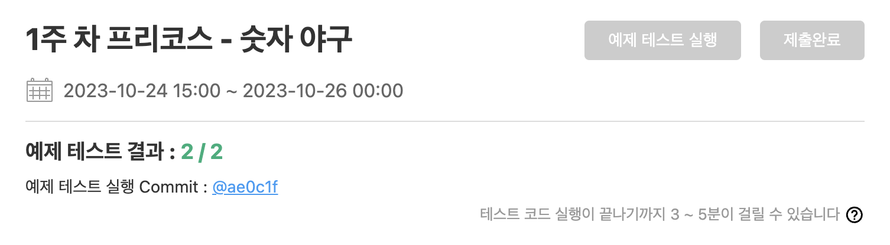

## **늦었지만 해보는 우테코 1주차 회고록: 숫자 야구 게임**
우아한테크코스 프리코스가 끝난지는 꽤 지났지만, 최종 코딩테스트를 준비할 겸 그리고 공부할 겸해서 회고록을 적어보려고 한다.  

회고록을 작성하기 전에 이 링크는 내가 제출한 코드이다.  
<https://github.com/gyeong3un2/javascript-baseball-6/tree/devGEP>  

<br>

일단 코드를 짜기 전에 **구현할 기능목록을 작성**해야 한다는 요구사항이 있었어서 그걸 먼저 작성했다.  
처음에는 이 단계의 중요성을 완전히 이해하지 못했지만, 프로젝트를 진행하면서 기능 구현 시 커밋 단위와 우선순위 결정에 큰 도움이 되었습니다.  
지금의 깃허브 docs에는 이렇게 되어 있지는 않다. 프리코스 4주차까지 하고 나서 docs를 정리해보니 이렇게 정리하는게 습관이 된 거 같다.  

## **숫자 야구 게임 흐름**
1. 게임시작
2. 컴퓨터 숫자 생성
3. 사용자 숫자 입력받기
4. 사용자 숫자와 컴퓨터 숫자 맞춰보기
  - 컴퓨터가 선택한 3개의 숫자를 모두 맞히면 게임이 종료
5. 종료 이후, 아래 둘 중 하나의 사용자의 입력을 받는다.
  - 게임을 다시 시작하고 싶다면, 1
  - 게임을 완전히 종료하고 싶다면, 2

<br>

## **기능 구현 목록**
### **입력**
- **사용자 숫자 입력받기**
  - `숫자를 입력해주세요 : `
  - **예외처리**
    - 입력받은 데이터가 숫자가 아닌 경우
    - 입력받은 데이터가 세자리 수가 아닌 경우
    - 입력받은 데이터 중에 중복되는 숫자가 있는 경우

- **종료 이후, 사용자 입력받기**
  - `게임을 새로 시작하려면 1, 종료하려면 2를 입력하세요.`
  - **예외처리**
    - 입력받은 데이터가 숫자가 아닌 경우
    - 입력받은 데이터가 1 또는 2가 아닌 경우

### **출력**
- **안내 메시지 출력하기**
  - `숫자 야구 게임을 시작합니다.`

- **사용자 숫자와 컴퓨터 숫자 맞춰보는 과정에서 결과 출력하기**
  - `${ball}볼 ${strike}스트라이크`
  - 둘 중 하나만 있다면, `${ball}볼` or `${strike}스트라이크`을 출력
  - **규칙**
    - 같은 수가 같은 자리이면, 스트라이크
    - 같은 수가 다른 자리이면, 볼
    - 같은 수가 전혀 없으면, 낫싱

- **숫자를 모두 맞췄을 경우 안내 메시지 출력하기**
  - `3개의 숫자를 모두 맞히셨습니다! 게임 종료`

이렇게 구현할 기능 목록을 작성해봤다.  

<br>

## **폴더 구조**
이때 당시에는 패턴같은 거 생각해보지 못하고, 심플하게 상수 폴더와 숫자 야구에 필요한 로직을 모아놓은 폴더와 유틸을 모아놓은 폴더로 나눴다.  

```javascript
// App.js
import GameController from './game/GameController.js';

class App {
  constructor() {
    this.gameMain = new GameController();
  }

  async play() {
    await this.gameMain.startGame();
}

}

export default App;
```
일단 **App.js** 파일을 먼저 설명하자면, **GameController.js**에 있는 `startGame()`이라는 함수만 호출한다. 이를 다시 생각해보면 **App.js**에서는 실행시키는 것 빼고는 하는 역할이 없는 거 같아서 시작, 실행, 종료 이 역할은 **App.js**에서 했으면 좋았을 거 같다는 생각이 든다. 

### **constants 폴더**
이곳에는 각종 상수를 넣어놨다.  
일단 <u>에러 메시지를 넣어놓은</u> **ErrorMessages.js** 파일이 있고, <u>게임 메시지를 넣어놓은</u> **GameMessages.js** 파일이 있다.  

<br>

```javascript
// ErrorMessages.js
export const ErrorMessages = {
  INVALID_NUMBER_INPUT: "[ERROR] 입력값이 잘못된 형식입니다.",
  INVALID_END_MESSAGE: "[ERROR] 입력값이 1 또는 2가 아닙니다."
}
```

지금와서 보니 **ErrorMessages.js** 파일에 1과 2 또한 상수로 빼야 하지 않을까 라는 생각이 든다.  
왜냐하면 만약 `1` 또는 `2`라는 숫자가 아닌 `3` 또는 `4`라는 숫자로 변경되었을 때, 로직에 있는 숫자와 메시지에 있는 숫자를 찾아서 일일이 바꿔야 하기 때문에 상수로 관리하는 게 맞을 거 같다.  
또한, `[Error]`라는 맨 앞에 붙은 거도 상수로 빼서 관리하면 좋을 거 같다.  

<br>

```javascript
// GameMessages.js
export const GameMessages = {
    START_GAME: "숫자 야구 게임을 시작합니다.",
    NUMBER_INPUT: "숫자를 입력해주세요 : ",
    END_GAME: "3개의 숫자를 모두 맞히셨습니다! 게임 종료",
    RETRY_GAME_OR_END_GAME: "게임을 새로 시작하려면 1, 종료하려면 2를 입력하세요."
}
```

**GameMessages.js** 파일에서 보면 여기서도 `1`과 `2`가 존재하기 때문에 따로 관리해야 될 거 같다.
그리고 3개의 숫자에서 `3`이라는 숫자도 상수로 빼야 하지 않았을까 라는 생각이 든다.  

이를 통해서 <span style="background-color: #dcffe4;">**상수 관리의 중요성에 대한 깨달음**</span>을 얻은거 같다.

<br>

### **game 폴더**
이 폴더에는 <u>게임 전반적인 로직을 관리하는</u> **GameController.js**와 <u>게임에서 중요한 로직을 관리하는</u> **GameLogic.js**이 있다.  

#### **GameController.js**
```javascript
import { MissionUtils } from "@woowacourse/mission-utils";
import { GameMessages } from "../constants/GameMessages.js";
import { ErrorMessages } from "../constants/ErrorMessages.js";
import GameLogic from "./GameLogic.js";
import Exception from "../utils/Exception.js";

class GameController {
  constructor() {
    this.gameLogic = new GameLogic();
  }

  async getUserInput(question) {
    return await MissionUtils.Console.readLineAsync(question);
  }

  async startGame() {
    MissionUtils.Console.print(GameMessages.START_GAME);
    await this.runGame();
  }

  async runGame() {
    let computerNumber = this.gameLogic.createComputerNumber();
    let userResult = '';

    while(true) {
      const userNumber = await this.getUserInput(GameMessages.NUMBER_INPUT);

      Exception.userNumberException(userNumber);

      const userNumberArray = userNumber.split('').map(Number);

      userResult = this.gameLogic.compareNumbers(computerNumber, userNumberArray);
      MissionUtils.Console.print(userResult);

      if (userResult === '3스트라이크') {
        return this.strike();
      }
    }
  }

  strike() {
    MissionUtils.Console.print(GameMessages.END_GAME);
    return this.restartGame();
  }

  async restartGame() {
    const answer = await this.getUserInput(GameMessages.RETRY_GAME_OR_END_GAME);

    if (answer === '1') {
      return this.runGame();
    } else if (answer === '2') {
      return false;
    } else {
      throw new Error(ErrorMessages.INVALID_END_MESSAGE);
    }
  }
}

export default GameController;
```
우선 **GameController.js** 파일에서 입력받은 부분과 출력하는 부분이 이곳에 있는데, 이러한 부분들을 **InputView.js**와 **OutputView.js** 파일을 만들어서 따로 빼서 관리하는게 좋을 거 같다.  
처음에 로직짤 때는 편리하겠지만, 나중에 유지보수할 때 입력하는 부분이 어디였지? 라는 생각이 들었다.  

<br>

`startGame()`이라는 함수는 일단 시작했을 때 보여주는 메시지와 실행시키는 함수를 호출한다. 그래서 일단 시작하는 하나의 역할을 한 것 같다.  

`runGame()`이라는 함수는 컴퓨터 숫자를 받고, 사용자 숫자를 입력받고 그 둘을 비교하고 결과까지 출력하는 함수이다.  
이 코드에서 return을 함수로 넘어가니까 어떤 로직인지 모르겠다는 피드백이 있었다.  
나는 이게 코드 짜기는 편했지만, 남들이 봤을 때는 모를 수도 있겠다는 생각이 들어서 다음 주차부터는 이를 줄였다.  

결과가 **3스트라이크**라면, `strike()`라는 함수로 넘기는데, 여기서는 게임이 끝났다는 메시지를 출력하고 `restartGame()`이라는 함수로 넘어간다.  

`restartGame()`이라는 함수에서는 재시작 안내 메시지를 출력시키고, **1**이면 `runGame()`을, **2**면 `종료`를, **이외**에는 `Error 메시지를 출력시키고 종료`시키는 방향으로 코드를 짰다.  
생각해보니 1과 2가 아닐 때 에러 메시지를 출력하는 거는 **Exception.js**에 넣어서 예외처리를 했어야 했던 거 같다.  
<br>

#### **GameLogic.js**
```javascript
import { MissionUtils } from "@woowacourse/mission-utils";

class GameLogic {
  constructor() {}

  createComputerNumber () {
    const computerNumber = [];
    
    while (computerNumber.length < 3) {
      const number = MissionUtils.Random.pickNumberInRange(1, 9);
      if (!computerNumber.includes(number)) {
        computerNumber.push(number);
      }
    }

    return computerNumber;
  }

  compareNumbers(computer, user) {
    let ball = 0;
    let strike = 0;

    for(let i = 0; i < 3 ; i++) {
      if (user.includes(computer[i])) {
        if (user.indexOf(computer[i]) === i) {
          strike += 1;
          continue;
        }
        ball += 1;
        continue;
      }
    }

    return this.printResult(ball, strike);
  }

  printResult(ball, strike) {
    let gameResult = '';

    if (ball === 0 && strike === 0) {
      gameResult = '낫싱';
    } else if (strike === 3) {
      gameResult = '3스트라이크';
    } else {
      if (ball && strike === 0) {
        gameResult = `${ball}볼`;
      } else if (ball === 0 && strike) {
        gameResult = `${strike}스트라이크`;
      }  else if (ball && strike) {
        gameResult = `${ball}볼 ${strike}스트라이크`;
      }
    }

    return gameResult;
  }
}

export default GameLogic;
```
**GameLogic.js** 파일에서는 컴퓨터 숫자를 생성하는 함수, 컴퓨터 숫자와 사용자 숫자를 비교하는 함수, 그리고 비교한 결과를 출력하는 함수가 있다.  

`createComputerNumber()` 함수는 이름을 **create**라는 표현도 맞지만, **generate**라는 표현이 더 맞을 거 같다. 
이 함수에서는 `@woowacourse/mission-utils`의 Random API를 활용해서 숫자를 받고, **computerNumber**에 포함되어 있지 않으면, **computerNumber**라는 배열에 넣는다. 이 방식을 3번 반복한다.  

`compareNumbers()` 함수는 **computer**와 **user**라는 배열을 각각 매개변수로 받는다. 그리고 비교한 다음에 printResult라는 결과를 출력하는 함수로 넘긴다.  

`printResult()` 함수는 **ball**과 **strike** 개수를 각각 매개변수로 받는다. 그리고 비교해서 결과를 출력한다.  

### **utils 폴더**
```javascript
// Exception.js
import { ErrorMessages } from "../constants/ErrorMessages.js";

class Exception {
    static userNumberException(answer) {
        const answerSet = new Set(answer.split("")); // Set으로 함으로써 중복된 숫자 제거 가능

        if (answerSet.size !== 3 || isNaN(answer) || answer.includes("0")) {
            throw new Error(ErrorMessages.INVALID_NUMBER_INPUT);
        }
    }
}

export default Exception;
```
이 곳에는 **Exception.js**만 넣어놨다. 이 **Exception.js** 파일에는 사용자가 숫자를 입력하면 그거에 대한 예외처리를 하는 것이다.  


## **마치며**
이 프로젝트를 통해 많은 것을 배웠고, 특히 <span style="background-color: #ffdce0;">**코드의 가독성과 유지보수성**</span>에 대해 깊이 생각해볼 수 있는 기회였습니다. 다음 프로젝트에서는 이번 경험을 바탕으로 **더욱 효과적인 코드 구조와 클린 코드 작성**에 집중하고자 합니다.  

