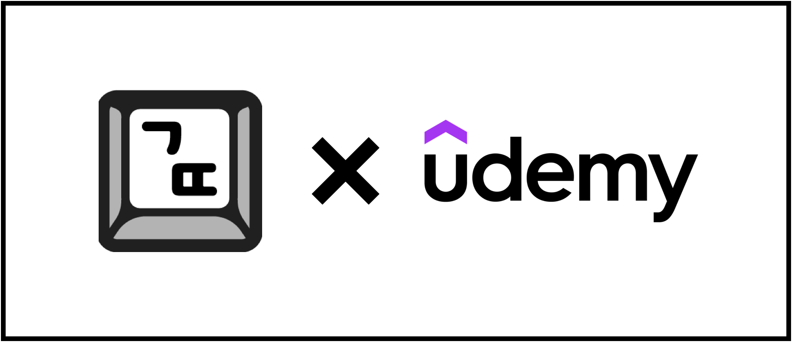
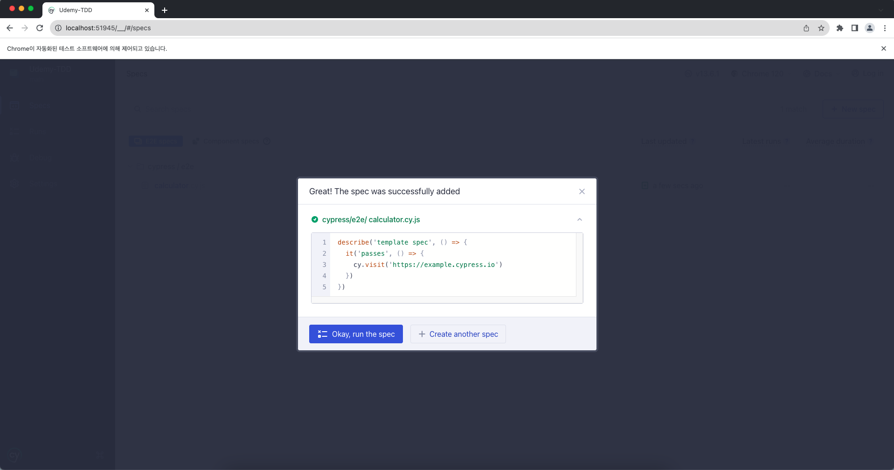

{: height="300"} 

## **수강한 강의 링크**
<https://www.udemy.com/course/tdd-for-frontend/>  
<br>

## **개념부터 듣는 강의가 어려운 강의가 아닙니다!**

프로그래밍을 배워서 어디에 써먹고 싶은지를 생각해본다면, **학습의 우선순위**를 세울 수 있다.  
처음에는 목표를 규모가 작게 설정하는 게 좋다.  

ex) **파워포인트를 배운다면 뭐부터 공부해야 할까?**  
당장 1주일 뒤에 내가 발표할 일이 있다면?  **시각화**가 필요하다면 **시각화**부터, **이미지**가 필요하다면 **이미지**부터 배울 수 있다.  
<br>

## **빠른 피드백의 중요성과 TDD**

ex) **프로그래밍을 공부할 때는 어떤 피드백들이 있을까?**  
테스트코드, 코드 리뷰, 짝 프로그래밍, 커뮤니티 참여 등  

### **TDD, Test Driven Development**

테스트를 먼저 만들고, 테스트를 통과하기 위한 코드를 짜는 개발 방법  

ex) **생년월일을 입력받아서 나이를 출력해주는 프로그램**  
```javascript
test("생년월일을 입력 받아서 나이를 출력한다.", 
{
  expect(함수(20000515)).toBe(23);
})
```
<br>

이러한 **테스트코드**를 먼저 짠다. 그리고 나서 이 테스트를 통과하기 위한 **최소한의 구현 코드**를 작성한다.  
아래는 간단하게 `getAge`라는 함수를 작성해보았다.  
```javascript
class App() {
  getAge(birthday) {
    return
  }
}
```
<br>

그리고 나서 함수 부분을 **구현한 함수**로 바꾸어준다음 테스트를 실행하면 통과 될 것이다.  
```javascript
test("생년월일을 입력 받아서 나이를 출력한다.", 
{
  expect(App.getAge(20000515)).toBe(23);
})
```
<br>

이렇듯 테스트를 먼저 만들고, 실제 코드를 작성하고, **원하는 대로 동작하는지 빠르게 피드백을 받는 것**이다.  
동작이 되고 나면 리팩토링을 하면 좋은 게, 일단 내가 구현한 기능이 동작되기 때문에 안심이 되고, 테스트 코드가 있기 때문에 기존 동작이 되는지 안되는지 피드백을 빠르게 받을 수 있다.  
<br>

- **결정**과 **피드백** 사이의 갭에 대한 인식  
- 결정과 피드백 사이의 **갭을 조절하기 위한 테크닉**  
<br>

여기서 **결정**은 <u>내가 코드로 구현하며 시도하려는 것</u>이고, **피드백**은 <u>성공/실패</u>이다.  
그래서 핵심은 더 자주, 더 빨리 '피드백'을 받는 것이 중요하다.  

내가 해결할 수 있는 가장 작은 영역의 문제부터 풀어 나가고 빠르게 피드백 받기가 중요하다.  
<br>

## **TDD적으로 이 강의를 효과적으로 듣는 방법**

1. **만들고 싶은 프로그램을 TDD로 구현해보기**  
작은 규모일수록 더 빠르게 피드백을 받고 더 빨리 사용해볼 수 있기에 더 좋다.  
사용자가 있다면 더 좋다.  

> **사용자란?**  
처음에는 작게 **나**부터 시작한다. 내가 사용해보고 개선해나갈 수 있다.  
그 다음은 **타인**으로 나간다. 여자친구나 친구나 선생님이 될 수 있다.  
그 다음은 **타인들**로 나간다. 타인들을 위한 서비스는 어렵다.
{: .prompt-tip }
<br>

강의에서는 다음과 같은 애플케이션을 토대로 만들어 나갈 것이다.  
**계산기** -> **자동차 경주 게임** -> **나만의 앱**  
<br>

## **Cypress**
<https://www.cypress.io/>  

- E2E 테스트를 위한 도구
- 마치 영화감독이 카메라를 이용해서 배우들을 촬영하는 것과 같이 앱 사이트가 제대로 동작하는지 확인할 수 있다.
- 중요한 동작들이 잘 동작되는가를 확인할 수 있다.
- 이외에도 테스트 도구들이 있지만, 직관적으로 처음에 접근하기 편리하기 때문에 우선적으로 이걸 사용할 것이다.  
<br>

## **실행 및 Cypress 설치**

<https://github.com/ssac-dev/tdd-calculator>  
<br>

클론 받고 아래 명령어를 통해 `cypress` 설치하기
```shell
npm install cypress --save-dev
```
<br>

<https://docs.cypress.io/guides/getting-started/opening-the-app>  

위 링크에서 cypress open 방법 중 아래 명령어를 통해서 할 것이다.  
```shell
npx cypress open
```

npx는 Node Package Runner의 약자로, Node.js 패키지를 실행하기 위한 명령어 도구 중 하나이다.  
npx는 전역 설치 없이 실행할 수 있다.  

명령어를 실행하면 다음과 같은 창이 뜨게 된다.  
{: height="300"}  
{: height="300"}  

- **E2E-testing**을 클릭하기
- **Configuration files**는 설정 파일들을 우리의 프로젝트에 추가한다는 것인데, 일단은 다 되어있는채로 Continue를 눌러보자.
- **Choose a browser**는 실제 사용자가 동작하는 것처럼 보여주기 위한 어떤 브라우저에서 테스트할 건지 선택하는 건데, 대부분의 사용자가 Chrome을 사용하기에 **Chrome**을 선택

설정을 완료했다면 브라우저가 새로 뜨면서 다음과 같은 페이지를 보여줄 것이다.  
{: height="300"}   

우리는 아직 어떠한 테스트 파일을 만든 적이 없기 떄문에, 위와 같은 이미지로 Create your first spec이라는게 뜬다.  

**Create new spec**을 눌러 새로운 spec을 생성해보자.  
우리는 계산기를 테스트할 것이기 때문에 calculator.cy.js파일을 생성하면, 테스트를 하기 위한 예시 테스트코드가 나온다. 일단 실행해보자.  

{: height="300"}  
{: height="300"} 

## Cypress 파일 설명

caculator.cy.js파일에서 cy는 Cypress를 의미한다.  

첫번째 인자 두번쨰 인자  
it이라는 함수를 실행하기 위해서 익  

`describe`와 `it`은 테스트 스크립트를 작성할 때 사용하는 함수이다. 작은 이야기를 만들어서 하나의 책을 만든다. 테스트 단위를 묶는 것이 `describe`이다.  

`it`이라는 함수 이름은 다음과 같이 사용할 수 있다. 하지만 이 강의에서는 굳이 영어가 아닌 한국어로 작성할 것이다.
```javascript
describe("template spec", () => {
  it("should ~ "); // 이것은 ~ 해야 한다.
  it("is expected ~"); // 이것은 ~로 기대된다.
})
```

현재 페이지를 방문해서 테스트하기 위해 예시에 쓰여 있던 `https://example.cypress.io`를 지우고, 계산기 앱이 있는 경로 `../../index.html`로 바꿔주자.

그리고 단위를 묶을 타이틀과 방문할 테스트 이름을 다음과 같이 바꿔주자. 그러면 다음과 같이 페이지가 바뀔 것이다.
```javascript
describe('계산기 앱 테스트', () => {
  it('계산기 페이지 접속', () => {
    cy.visit('../../index.html')
  })
})
```
{: height="300"}  
<br>

## **테스트 코드 작성하기 전엔 무엇을 해야할까?**

TDD로 계산기를 구현한다고 했을 떄, 계산기의 핵심은 연산의 결과를 나타내는 것이다.
그렇다면 여기서 핵심 기능부터 테스트하는 것이 중요하다. 일단 완성해야 하는 요구사항은 다음과 같다.
```
- [ ] 2개의 숫자에 대해 덧셈이 가능하다.
- [ ] 2개의 숫자에 대해 뺄셈이 가능하다.
- [ ] 2개의 숫자에 대해 곱셈이 가능하다.
- [ ] 2개의 숫자에 대해 나눗셈이 가능하다.
- [ ] AC(All Clear)버튼을 누르면 0으로 초기화 한다.
- [ ] 숫자는 한번에 최대 3자리 수까지 입력 가능하다.
- [ ] 계산 결과를 표현할 때 소수점 이하는 버림한다.
```

<br>

## **강의 후기**

이번에 수강한 "[유데미(Udemy)] TDD로 배우는 웹 프론트엔드" 강의는 프론트엔드 개발에 있어서 테스트 주도 개발(TDD)을 실제로 어떻게 적용할 수 있는지에 대해 배울 수 있는 매우 유익한 경험이었습니다. 강의는 기본적인 개념 설명부터 시작하여 실제 예제를 통한 적용 방법까지 단계별로 설명해주어, TDD에 대한 이해도를 높일 수 있었습니다.

### **강의의 장점**

- **실용적인 예제**: 계산기 앱과 자동차 경주 게임 등 실생활에서 볼 수 있는 예제를 통해 TDD를 적용하는 방법을 배울 수 있었습니다. 이를 통해 이론적인 지식뿐만 아니라 실제 개발 과정에서 TDD를 어떻게 활용할 수 있는지에 대한 이해도를 높일 수 있었습니다.
- **접근성**: TDD가 처음인 개발자도 쉽게 따라갈 수 있도록 기본 개념부터 차근차근 설명해주며, Cypress와 같은 테스트 도구 사용 방법도 자세히 안내해줍니다. 이로 인해 테스트 도구에 대한 두려움 없이 TDD를 시작할 수 있었습니다.
- **빠른 피드백의 중요성 인식**: 강의를 통해 코드를 작성한 후 빠르게 피드백을 받는 것의 중요성을 깨달을 수 있었습니다. 이는 개발 과정에서 발생할 수 있는 오류를 조기에 발견하고 수정할 수 있게 해주어, 보다 효율적인 개발이 가능하게 합니다.

### **총평**

전반적으로 이 강의는 TDD를 배우고 싶은 웹 프론트엔드 개발자에게 매우 추천할 만한 강의입니다. 실제 프로젝트에 TDD를 적용해보고 싶었던 개발자로서, 이 강의를 통해 많은 인사이트를 얻을 수 있었고, 앞으로의 프로젝트에도 TDD를 적극적으로 활용할 계획입니다.  
<br>


> 해당 콘텐츠는 유데미로부터 강의 쿠폰을 제공받아 작성되었습니다.