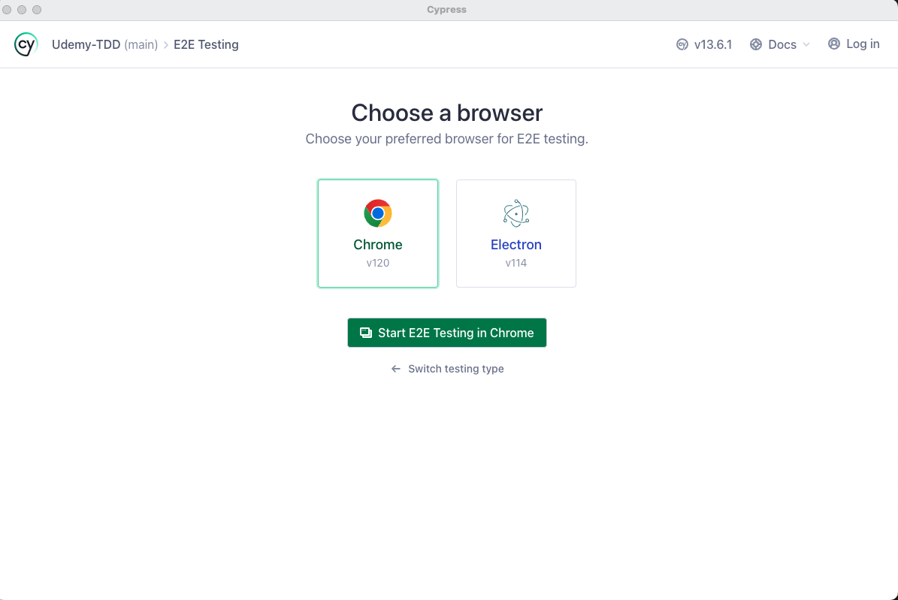
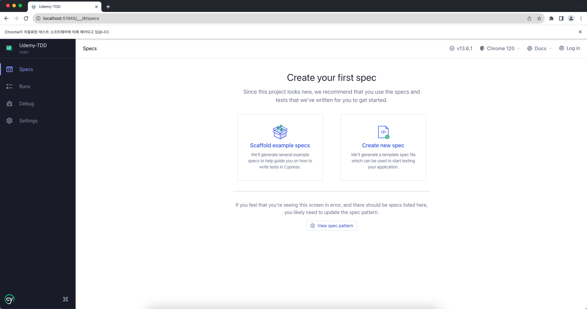
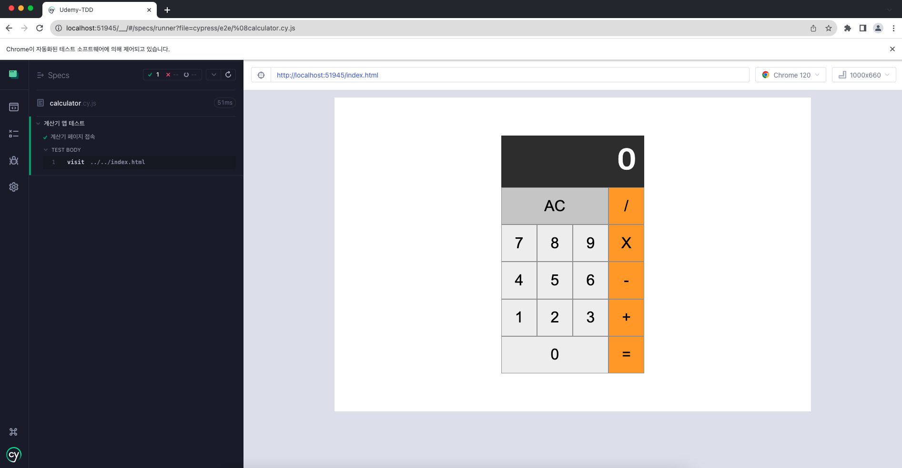

{: height="300"} 

## **TDD로 계산기 구현하기**

계산기의 핵심
- 연산의 결과를 나타내는 것
<br>

### **Cypress**
<https://www.cypress.io/>  

- E2E 테스트를 위한 도구
- 마치 영화감독이 카메라를 이용해서 배우들을 촬영하는 것과 같이 앱 사이트가 제대로 동작하는지 확인할 수 있다.
- 중요한 동작들이 잘 동작되는가를 확인할 수 있다.
- 이외에도 테스트 도구들이 있지만, 직관적으로 처음에 접근하기 편리하기 때문에 우선적으로 이걸 사용할 것이다.  
<br>

## **실행 및 Cypress 설치**

<https://github.com/ssac-dev/tdd-calculator>  
<br>

클론 받고 아래 명령어를 통해 `cypress` 설치하기
```shell
npm install cypress --save-dev
```
<br>

<https://docs.cypress.io/guides/getting-started/opening-the-app>  

위 링크에서 cypress open 방법 중 아래 명령어를 통해서 할 것이다.  
```shell
npx cypress open
```

npx는 Node Package Runner의 약자로, Node.js 패키지를 실행하기 위한 명령어 도구 중 하나이다.  
npx는 전역 설치 없이 실행할 수 있다.  

명령어를 실행하면 다음과 같은 창이 뜨게 된다.  
{: height="300"}  
{: height="300"}  

- **E2E-testing**을 클릭하기
- **Configuration files**는 설정 파일들을 우리의 프로젝트에 추가한다는 것인데, 일단은 다 되어있는채로 Continue를 눌러보자.
- **Choose a browser**는 실제 사용자가 동작하는 것처럼 보여주기 위한 어떤 브라우저에서 테스트할 건지 선택하는 건데, 대부분의 사용자가 Chrome을 사용하기에 **Chrome**을 선택

설정을 완료했다면 브라우저가 새로 뜨면서 다음과 같은 페이지를 보여줄 것이다.  
{: height="300"}   

우리는 아직 어떠한 테스트 파일을 만든 적이 없기 떄문에, 위와 같은 이미지로 Create your first spec이라는게 뜬다.  

**Create new spec**을 눌러 새로운 spec을 생성해보자.  
우리는 계산기를 테스트할 것이기 때문에 calculator.cy.js파일을 생성하면, 테스트를 하기 위한 예시 테스트코드가 나온다. 일단 실행해보자.  

{: height="300"}  
{: height="300"} 

## Cypress 파일 설명

caculator.cy.js파일에서 cy는 Cypress를 의미한다.  

첫번째 인자 두번쨰 인자  
it이라는 함수를 실행하기 위해서 익  

`describe`와 `it`은 테스트 스크립트를 작성할 때 사용하는 함수이다. 작은 이야기를 만들어서 하나의 책을 만든다. 테스트 단위를 묶는 것이 `describe`이다.  

`it`이라는 함수 이름은 다음과 같이 사용할 수 있다. 하지만 이 강의에서는 굳이 영어가 아닌 한국어로 작성할 것이다.
```javascript
describe("template spec", () => {
  it("should ~ "); // 이것은 ~ 해야 한다.
  it("is expected ~"); // 이것은 ~로 기대된다.
})
```

현재 페이지를 방문해서 테스트하기 위해 예시에 쓰여 있던 `https://example.cypress.io`를 지우고, 계산기 앱이 있는 경로 `../../index.html`로 바꿔주자.

그리고 단위를 묶을 타이틀과 방문할 테스트 이름을 다음과 같이 바꿔주자. 그러면 다음과 같이 페이지가 바뀔 것이다.
```javascript
describe('계산기 앱 테스트', () => {
  it('계산기 페이지 접속', () => {
    cy.visit('../../index.html')
  })
})
```
{: height="300"}  
<br>

## 테스트 코드 작성하기

테스트 코드를 작성하기 전 어떠한 테스트부터 작성해야 할까?  
핵심 기능부터 테스트하는 것이 중요하다. 일단 완성해야 하는 요구사항은 다음과 같다.  
```
- [ ] 2개의 숫자에 대해 덧셈이 가능하다.
- [ ] 2개의 숫자에 대해 뺄셈이 가능하다.
- [ ] 2개의 숫자에 대해 곱셈이 가능하다.
- [ ] 2개의 숫자에 대해 나눗셈이 가능하다.
- [ ] AC(All Clear)버튼을 누르면 0으로 초기화 한다.
- [ ] 숫자는 한번에 최대 3자리 수까지 입력 가능하다.
- [ ] 계산 결과를 표현할 때 소수점 이하는 버림한다.
```

dom 엘리먼트의 값을 가져오거나 값을 입력할 때, dom에 접근하기 위해서 query selector를 사용하는 것처럼 Cypress에서는 get을 사용한다.

it과 it은 서로 다른 테스트이므로 방문하는 것을 표시할 때 실행해야 한다. 

-----------------------------------------------
해당 콘텐츠는 유데미로부터 강의 쿠폰을 제공받아 작성되었습니다.